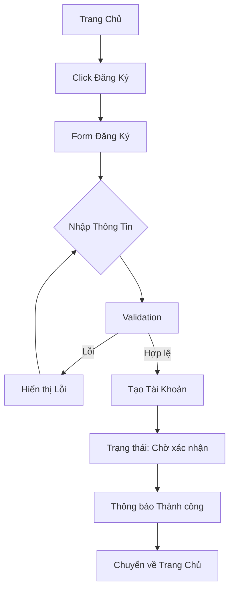

# Luồng Đăng Ký (Registration Flow)

## Tổng Quan
Luồng cho phép người dùng mới đăng ký tài khoản trong hệ thống.

## Actor
- Mọi người (không cần đăng nhập)

## Diagram

## Các Bước Chi Tiết

### 1. Người dùng click "Đăng Ký"
- Vị trí: Trang chủ hoặc trang đăng nhập
- Action: Chuyển đến trang đăng ký

### 2. Nhập thông tin
Form đăng ký bao gồm:
- **Email**: Định dạng email hợp lệ
- **Tên**: Không được để trống, tối đa 50 ký tự
- **Mật khẩu**: Tối thiểu 8 ký tự, tối đa 16 ký tự
- **Xác nhận mật khẩu**: Phải trùng với mật khẩu

### 3. Validation
- **Client-side**: Kiểm tra ngay khi người dùng nhập
- **Server-side**: Kiểm tra lại trước khi lưu vào database

### 4. Tạo tài khoản
- Hash mật khẩu (bcrypt)
- Tạo user với role mặc định: "Reader"
- Trạng thái: "Chờ xác nhận" (Pending)

### 5. Thông báo kết quả
- Thành công: "Đăng ký thành công! Vui lòng đợi xác nhận."
- Lỗi: Hiển thị lỗi cụ thể

## Validation Rules

| Field | Rules |
|-------|-------|
| Email | - Định dạng email hợp lệ - Chưa tồn tại trong hệ thống |
| Tên | - Không được để trống - Tối đa 50 ký tự |
| Mật khẩu | - Tối thiểu 8 ký tự - Tối đa 16 ký tự - Nên có chữ hoa, chữ thường, số |
| Xác nhận mật khẩu | - Phải trùng với mật khẩu |

## Error Handling

| Lỗi | Thông báo |
|-----|-----------|
| Email đã tồn tại | "Email này đã được sử dụng" |
| Mật khẩu không khớp | "Mật khẩu xác nhận không khớp" |
| Email không hợp lệ | "Vui lòng nhập email hợp lệ" |
| Mật khẩu quá ngắn | "Mật khẩu phải có ít nhất 8 ký tự" |

