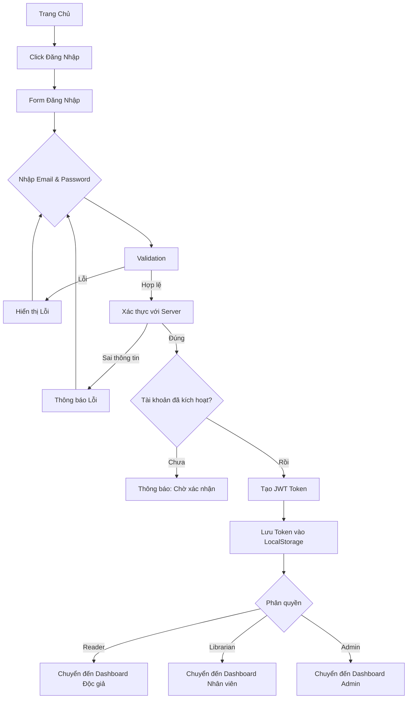

# Luồng Đăng Nhập (Login Flow)

## Tổng Quan
Luồng cho phép người dùng đăng nhập vào hệ thống với email và mật khẩu.

## Actor
- Mọi người (không cần đăng nhập)

## Diagram

## Các Bước Chi Tiết

### 1. Người dùng nhập thông tin
- **Email**: Định dạng email hợp lệ
- **Mật khẩu**: Tối thiểu 8 ký tự, tối đa 16 ký tự

### 2. Validation Client-side
- Kiểm tra định dạng email
- Kiểm tra mật khẩu không rỗng

### 3. Xác thực với Server
- Gửi request POST `/api/auth/login`
- Server kiểm tra:
  - Email có tồn tại không
  - Mật khẩu có đúng không
  - Tài khoản có bị vô hiệu hóa không

### 4. Tạo Session
- Tạo JWT token với thông tin:
  - User ID
  - Role (Reader/Librarian/Admin)
  - Thời hạn: 24 giờ

### 5. Lưu Token
- Lưu vào LocalStorage
- Lưu vào Cookie (optional, cho security)

### 6. Chuyển hướng theo Role
- **Reader**: `/reader/dashboard`
- **Librarian**: `/librarian/dashboard`
- **Admin**: `/admin/dashboard`

## Validation Rules

| Field | Rules |
|-------|-------|
| Email | - Định dạng email hợp lệ - Không được để trống |
| Mật khẩu | - Không được để trống - Tối thiểu 8 ký tự - Tối đa 16 ký tự |

## Error Handling

| Lỗi | Thông báo | HTTP Status |
|-----|-----------|-------------|
| Email không tồn tại | "Email hoặc mật khẩu không đúng" | 401 |
| Mật khẩu sai | "Email hoặc mật khẩu không đúng" | 401 |
| Tài khoản chưa kích hoạt | "Tài khoản của bạn chưa được kích hoạt" | 403 |
| Tài khoản bị vô hiệu hóa | "Tài khoản của bạn đã bị vô hiệu hóa" | 403 |

## Security Considerations

- Không hiển thị lỗi cụ thể (email không tồn tại vs mật khẩu sai)
- Rate limiting: Giới hạn số lần đăng nhập thất bại
- JWT token có expiration time
- Hash mật khẩu bằng bcrypt

