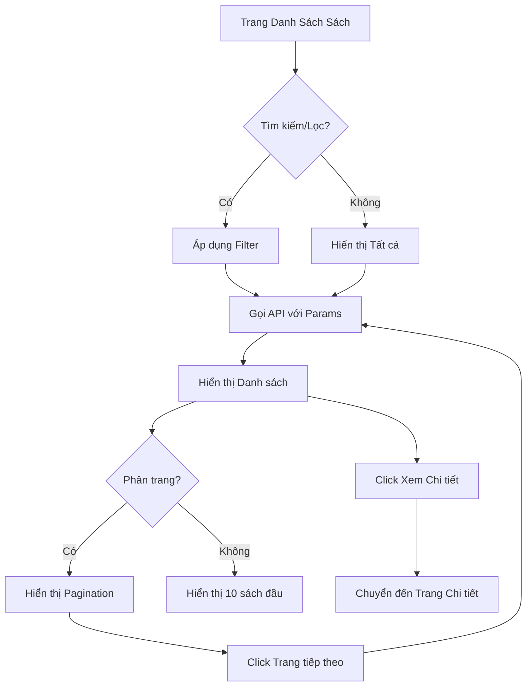

# Luồng Xem Danh Sách Sách (Book List Flow)

## Tổng Quan
Luồng cho phép tất cả người dùng (kể cả chưa đăng nhập) xem danh sách sách với các tính năng tìm kiếm, lọc và sắp xếp.

## Actor
- Tất cả người dùng (không cần đăng nhập)

## Diagram



## Các Bước Chi Tiết

### 1. Hiển thị danh sách sách
- Load trang đầu tiên (10 sách)
- Hiển thị thông tin:
  - Tên sách
  - Tác giả
  - Năm xuất bản
  - Thể loại
  - Số lượng có sẵn
  - Số lượng đang mượn

### 2. Tìm kiếm
- Input: Tên sách hoặc tác giả
- Tìm kiếm real-time hoặc khi nhấn Enter
- API: `GET /api/books?search=keyword`

### 3. Lọc theo thể loại
- Dropdown chọn thể loại
- API: `GET /api/books?category=categoryId`

### 4. Sắp xếp
- Options:
  - Tên (A-Z)
  - Năm xuất bản (Mới nhất)
  - Lượt mượn (Phổ biến nhất)
- API: `GET /api/books?sort=name|year|popular`

### 5. Phân trang
- 10 sách trên 1 trang
- Hiển thị số trang và nút Previous/Next
- API: `GET /api/books?page=1&limit=10`

### 6. Xem chi tiết
- Click vào sách → Chuyển đến `/books/:id`

## API Endpoints

| Method | Endpoint | Description |
|--------|----------|-------------|
| GET | `/api/books` | Lấy danh sách sách (có query params) |
| GET | `/api/books/:id` | Lấy chi tiết sách |
| GET | `/api/categories` | Lấy danh sách thể loại |

## Query Parameters

| Param | Type | Description |
|-------|------|-------------|
| `search` | string | Tìm kiếm theo tên/tác giả |
| `category` | number | Lọc theo thể loại ID |
| `sort` | string | Sắp xếp: `name`, `year`, `popular` |
| `page` | number | Số trang (mặc định: 1) |
| `limit` | number | Số lượng mỗi trang (mặc định: 10) |

## Response Format

```json
{
  "data": [
    {
      "id": 1,
      "title": "Tên sách",
      "author": "Tác giả",
      "year": 2023,
      "category": "Thể loại",
      "available": 5,
      "borrowed": 3
    }
  ],
  "pagination": {
    "page": 1,
    "limit": 10,
    "total": 100,
    "totalPages": 10
  }
}
```

