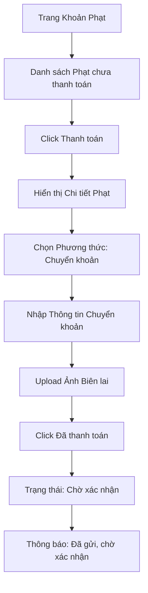
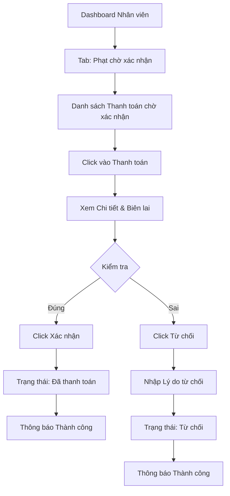

# Luồng Thanh Toán Phạt (Fine Payment Flow)

## Tổng Quan
Luồng cho phép độc giả thanh toán các khoản phạt và nhân viên xác nhận thanh toán.

## Actor
- Độc giả (Reader) - Thanh toán
- Nhân viên thư viện (Librarian) - Xác nhận thanh toán

## Diagram - Độc Giả Thanh Toán



## Diagram - Nhân Viên Xác Nhận



## Các Bước Chi Tiết - Độc Giả

### 1. Xem danh sách khoản phạt
- API: `GET /api/fines/my-fines?status=unpaid`
- Hiển thị:
  - Nguyên nhân phạt
  - Số tiền
  - Ngày phạt
  - Trạng thái

### 2. Thanh toán
- Click "Thanh toán" trên phiếu phạt
- Hiển thị form:
  - Thông tin chuyển khoản (số tài khoản, ngân hàng)
  - Upload ảnh biên lai (optional nhưng khuyến khích)

### 3. Gửi yêu cầu xác nhận
- API: `POST /api/fines/:id/pay`
- Body:
  ```json
  {
    "paymentMethod": "bank_transfer",
    "receiptImage": "base64_or_url",
    "note": "Ghi chú"
  }
  ```
- Cập nhật trạng thái: "unpaid" → "pending_confirmation"

## Các Bước Chi Tiết - Nhân Viên

### 1. Xem danh sách thanh toán chờ xác nhận
- API: `GET /api/fines?status=pending_confirmation`
- Hiển thị:
  - Tên độc giả
  - Nguyên nhân phạt
  - Số tiền
  - Ảnh biên lai (nếu có)

### 2. Xác nhận thanh toán
- API: `PATCH /api/fines/:id/confirm`
- Cập nhật trạng thái: "pending_confirmation" → "paid"
- Ghi nhận ngày thanh toán

### 3. Từ chối thanh toán
- API: `PATCH /api/fines/:id/reject`
- Body:
  ```json
  {
    "reason": "Số tiền không khớp"
  }
  ```
- Cập nhật trạng thái: "pending_confirmation" → "rejected"
- Lưu lý do từ chối

## API Endpoints

| Method | Endpoint | Description |
|--------|----------|-------------|
| GET | `/api/fines/my-fines` | Lấy danh sách phạt của độc giả |
| POST | `/api/fines/:id/pay` | Gửi yêu cầu thanh toán |
| GET | `/api/fines?status=pending_confirmation` | Lấy danh sách chờ xác nhận (Librarian) |
| PATCH | `/api/fines/:id/confirm` | Xác nhận thanh toán |
| PATCH | `/api/fines/:id/reject` | Từ chối thanh toán |

## Request Body

### Pay Fine
```json
{
  "paymentMethod": "bank_transfer",
  "receiptImage": "data:image/jpeg;base64,...",
  "note": "Đã chuyển khoản ngày 20/01/2024"
}
```

### Reject Payment
```json
{
  "reason": "Số tiền không khớp với số tiền phạt"
}
```

## Response

### Success (200)
```json
{
  "message": "Đã xác nhận thanh toán thành công",
  "data": {
    "id": 1,
    "status": "paid",
    "paidDate": "2024-01-20T10:00:00Z"
  }
}
```

## Validation Rules

| Field | Rules |
|-------|-------|
| Lý do từ chối | - Bắt buộc khi từ chối<br>- Tối đa 500 ký tự |
| Ảnh biên lai | - Format: jpg, png<br>- Max size: 5MB |

## Error Handling

| Lỗi | Thông báo | Status Code |
|-----|-----------|-------------|
| Không tìm thấy phiếu phạt | "Không tìm thấy phiếu phạt" | 404 |
| Đã thanh toán | "Phiếu phạt này đã được thanh toán" | 400 |
| Số tiền không khớp | "Số tiền không khớp" | 400 |
| Thiếu lý do từ chối | "Vui lòng nhập lý do từ chối" | 400 |

