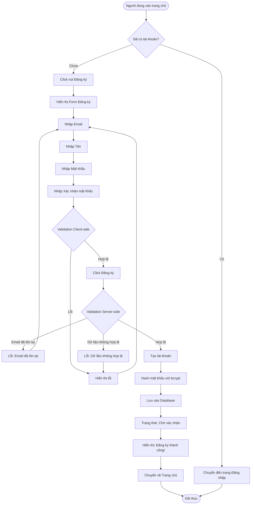

# 2.1.1 - Đăng Ký (User Registration)

## Tổng Quan
Luồng cho phép người dùng mới đăng ký tài khoản trong hệ thống.

## Actor
- Mọi người (không cần đăng nhập)

## Mermaid Flowchart



## Các Bước Chi Tiết

### 1. Truy cập trang đăng ký
- Người dùng click "Đăng ký" từ trang chủ hoặc trang đăng nhập
- Chuyển đến `/register`

### 2. Nhập thông tin
Form đăng ký bao gồm:
- **Email**: Định dạng email hợp lệ
- **Tên**: Không được để trống, tối đa 50 ký tự
- **Mật khẩu**: Tối thiểu 8 ký tự, tối đa 16 ký tự
- **Xác nhận mật khẩu**: Phải trùng với mật khẩu

### 3. Validation Client-side
- Kiểm tra ngay khi người dùng nhập
- Hiển thị lỗi real-time

### 4. Validation Server-side
- Kiểm tra lại trước khi lưu
- Kiểm tra email đã tồn tại chưa

### 5. Tạo tài khoản
- Hash mật khẩu bằng bcrypt
- Tạo user với role mặc định: "Reader"
- Trạng thái: "Chờ xác nhận" (Pending)

### 6. Thông báo kết quả
- Thành công: "Đăng ký thành công! Vui lòng đợi xác nhận."
- Lỗi: Hiển thị lỗi cụ thể

## Validation Rules

| Field | Rules |
|-------|-------|
| Email | - Định dạng email hợp lệ<br>- Chưa tồn tại trong hệ thống |
| Tên | - Không được để trống<br>- Tối đa 50 ký tự |
| Mật khẩu | - Tối thiểu 8 ký tự<br>- Tối đa 16 ký tự<br>- Nên có chữ hoa, chữ thường, số |
| Xác nhận mật khẩu | - Phải trùng với mật khẩu |

## API Endpoints

| Method | Endpoint | Description |
|--------|----------|-------------|
| POST | `/api/auth/register` | Đăng ký tài khoản mới |

## Request Body

```json
{
  "email": "user@example.com",
  "name": "Nguyễn Văn A",
  "password": "password123",
  "confirmPassword": "password123"
}
```

## Response

### Success (201)
```json
{
  "message": "Đăng ký thành công! Vui lòng đợi xác nhận.",
  "data": {
    "id": 1,
    "email": "user@example.com",
    "name": "Nguyễn Văn A",
    "role": "Reader",
    "status": "pending"
  }
}
```

### Error (400)
```json
{
  "error": "Email đã được sử dụng"
}
```

## Error Handling

| Lỗi | Thông báo | Status Code |
|-----|-----------|-------------|
| Email đã tồn tại | "Email này đã được sử dụng" | 400 |
| Mật khẩu không khớp | "Mật khẩu xác nhận không khớp" | 400 |
| Email không hợp lệ | "Vui lòng nhập email hợp lệ" | 400 |
| Mật khẩu quá ngắn | "Mật khẩu phải có ít nhất 8 ký tự" | 400 |
| Mật khẩu quá dài | "Mật khẩu không được quá 16 ký tự" | 400 |
| Tên để trống | "Tên không được để trống" | 400 |
| Tên quá dài | "Tên không được quá 50 ký tự" | 400 |

