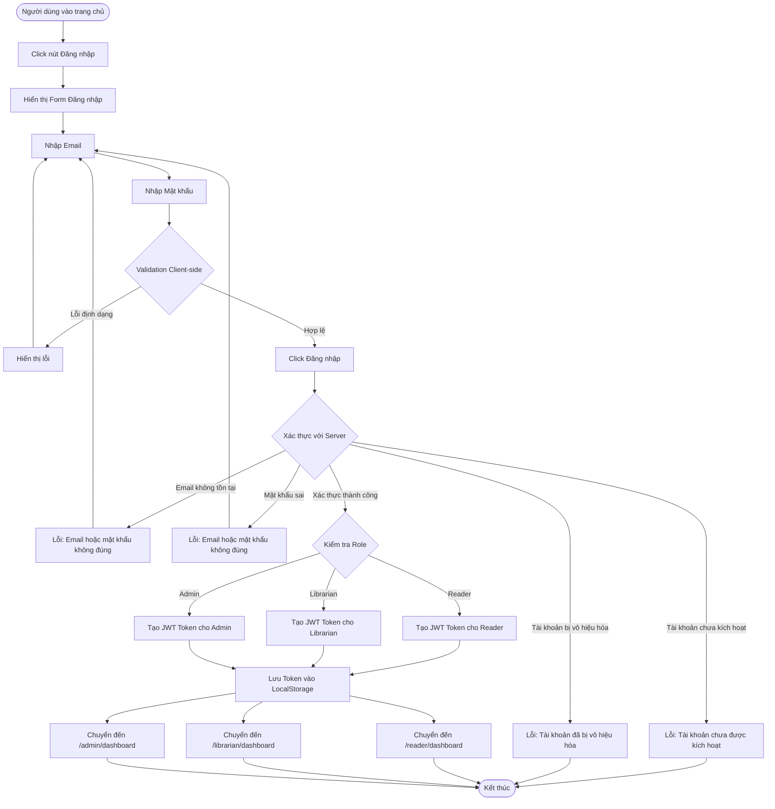

# 2.1.2 - Đăng Nhập (User Login)

## Tổng Quan
Luồng cho phép người dùng đăng nhập vào hệ thống với email và mật khẩu.

## Actor
- Mọi người (không cần đăng nhập)

## Mermaid Flowchart



## Các Bước Chi Tiết

### 1. Truy cập trang đăng nhập
- Người dùng click "Đăng nhập" từ trang chủ
- Chuyển đến `/login`

### 2. Nhập thông tin
- **Email**: Định dạng email hợp lệ
- **Mật khẩu**: Tối thiểu 8 ký tự, tối đa 16 ký tự

### 3. Validation Client-side
- Kiểm tra định dạng email
- Kiểm tra mật khẩu không rỗng

### 4. Xác thực với Server
- Gửi request POST `/api/auth/login`
- Server kiểm tra:
  - Email có tồn tại không
  - Mật khẩu có đúng không
  - Tài khoản có bị vô hiệu hóa không

### 5. Tạo Session
- Tạo JWT token với thông tin:
  - User ID
  - Role (Reader/Librarian/Admin)
  - Thời hạn: 24 giờ

### 6. Lưu Token
- Lưu vào LocalStorage
- Lưu vào Cookie (optional, cho security)

### 7. Chuyển hướng theo Role
- **Reader**: `/reader/dashboard`
- **Librarian**: `/librarian/dashboard`
- **Admin**: `/admin/dashboard`

## Validation Rules

| Field | Rules |
|-------|-------|
| Email | - Định dạng email hợp lệ<br>- Không được để trống |
| Mật khẩu | - Không được để trống<br>- Tối thiểu 8 ký tự<br>- Tối đa 16 ký tự |

## API Endpoints

| Method | Endpoint | Description |
|--------|----------|-------------|
| POST | `/api/auth/login` | Đăng nhập |

## Request Body

```json
{
  "email": "user@example.com",
  "password": "password123"
}
```

## Response

### Success (200)
```json
{
  "message": "Đăng nhập thành công",
  "data": {
    "token": "eyJhbGciOiJIUzI1NiIsInR5cCI6IkpXVCJ9...",
    "user": {
      "id": 1,
      "email": "user@example.com",
      "name": "Nguyễn Văn A",
      "role": "Reader"
    }
  }
}
```

### Error (401)
```json
{
  "error": "Email hoặc mật khẩu không đúng"
}
```

### Error (403)
```json
{
  "error": "Tài khoản chưa được kích hoạt"
}
```

## Error Handling

| Lỗi | Thông báo | HTTP Status |
|-----|-----------|-------------|
| Email không tồn tại | "Email hoặc mật khẩu không đúng" | 401 |
| Mật khẩu sai | "Email hoặc mật khẩu không đúng" | 401 |
| Tài khoản chưa kích hoạt | "Tài khoản của bạn chưa được kích hoạt" | 403 |
| Tài khoản bị vô hiệu hóa | "Tài khoản của bạn đã bị vô hiệu hóa" | 403 |
| Email không hợp lệ | "Vui lòng nhập email hợp lệ" | 400 |
| Mật khẩu để trống | "Mật khẩu không được để trống" | 400 |

## Security Considerations

- Không hiển thị lỗi cụ thể (email không tồn tại vs mật khẩu sai)
- Rate limiting: Giới hạn số lần đăng nhập thất bại (ví dụ: 5 lần/15 phút)
- JWT token có expiration time (24 giờ)
- Hash mật khẩu bằng bcrypt
- Token được lưu an toàn (HttpOnly cookie nếu có thể)

