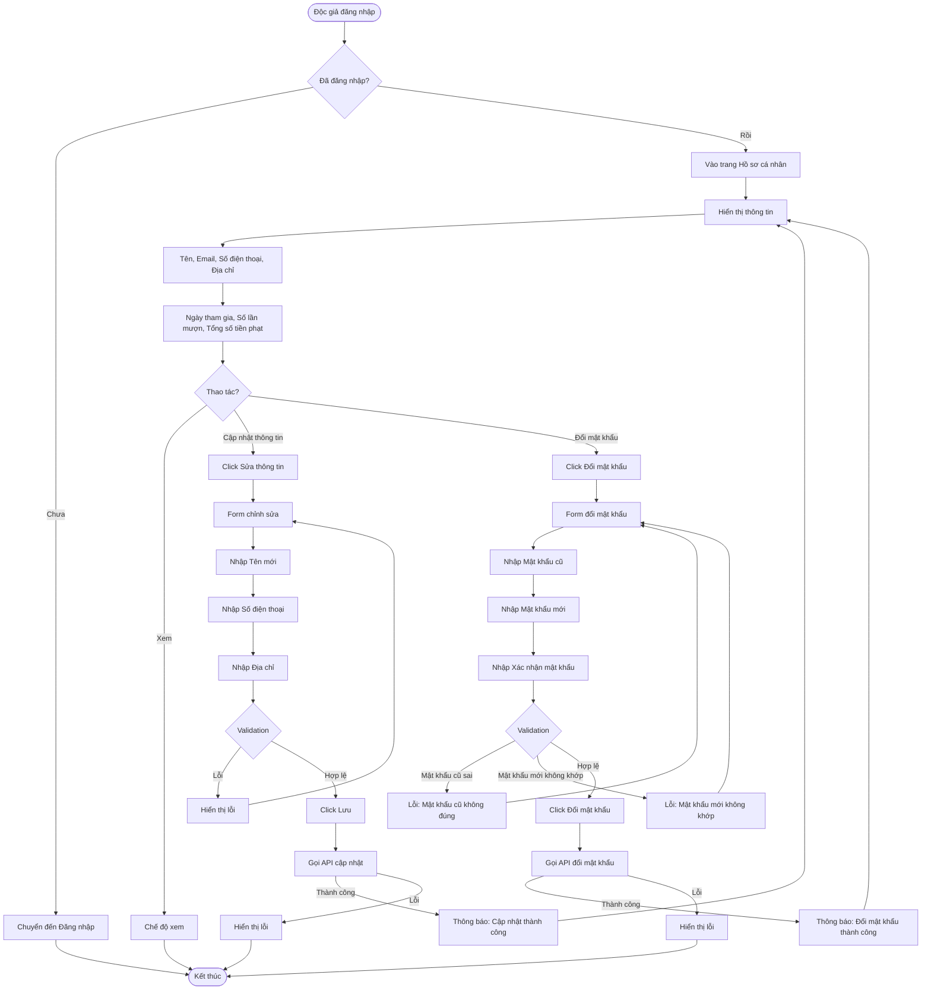

# 2.1.3 - Hồ Sơ Cá Nhân (User Profile)

## Tổng Quan
Luồng cho phép độc giả xem và cập nhật thông tin cá nhân, thay đổi mật khẩu.

## Actor
- Độc giả (Reader) - cần đăng nhập

## Mermaid Flowchart



## Các Bước Chi Tiết

### 1. Truy cập trang hồ sơ
- Độc giả đăng nhập
- Vào trang "Hồ sơ cá nhân" (`/reader/profile`)

### 2. Hiển thị thông tin
**Thông tin cá nhân:**
- Tên
- Email
- Số điện thoại
- Địa chỉ

**Thống kê:**
- Ngày tham gia
- Số lần mượn
- Tổng số tiền phạt

### 3. Cập nhật thông tin cá nhân
- Click "Sửa thông tin"
- Chỉnh sửa: Tên, Số điện thoại, Địa chỉ
- Validate dữ liệu
- Lưu thay đổi

### 4. Thay đổi mật khẩu
- Click "Đổi mật khẩu"
- Nhập mật khẩu cũ
- Nhập mật khẩu mới
- Xác nhận mật khẩu mới
- Validate và lưu

## Validation Rules

| Field | Rules |
|-------|-------|
| Tên | - Không được để trống<br>- Tối đa 50 ký tự |
| Số điện thoại | - Định dạng số điện thoại hợp lệ |
| Địa chỉ | - Không được để trống<br>- Tối đa 255 ký tự |
| Mật khẩu cũ | - Phải đúng với mật khẩu hiện tại |
| Mật khẩu mới | - Tối thiểu 8 ký tự<br>- Tối đa 16 ký tự |
| Xác nhận mật khẩu | - Phải trùng với mật khẩu mới |

## API Endpoints

| Method | Endpoint | Description |
|--------|----------|-------------|
| GET | `/api/users/profile` | Lấy thông tin hồ sơ |
| PATCH | `/api/users/profile` | Cập nhật thông tin cá nhân |
| PATCH | `/api/users/change-password` | Thay đổi mật khẩu |

## Request Body

### Update Profile
```json
{
  "name": "Nguyễn Văn A",
  "phone": "0123456789",
  "address": "123 Đường ABC, Quận XYZ, TP.HCM"
}
```

### Change Password
```json
{
  "oldPassword": "oldpassword123",
  "newPassword": "newpassword123",
  "confirmPassword": "newpassword123"
}
```

## Response

### Success (200)
```json
{
  "message": "Cập nhật thông tin thành công",
  "data": {
    "id": 1,
    "name": "Nguyễn Văn A",
    "email": "user@example.com",
    "phone": "0123456789",
    "address": "123 Đường ABC, Quận XYZ, TP.HCM"
  }
}
```

## Error Handling

| Lỗi | Thông báo | Status Code |
|-----|-----------|-------------|
| Chưa đăng nhập | "Vui lòng đăng nhập" | 401 |
| Token hết hạn | "Phiên đăng nhập đã hết hạn" | 401 |
| Tên để trống | "Tên không được để trống" | 400 |
| Tên quá dài | "Tên không được quá 50 ký tự" | 400 |
| Số điện thoại không hợp lệ | "Số điện thoại không hợp lệ" | 400 |
| Địa chỉ để trống | "Địa chỉ không được để trống" | 400 |
| Địa chỉ quá dài | "Địa chỉ không được quá 255 ký tự" | 400 |
| Mật khẩu cũ sai | "Mật khẩu cũ không đúng" | 400 |
| Mật khẩu mới không khớp | "Mật khẩu mới không khớp" | 400 |
| Mật khẩu mới quá ngắn | "Mật khẩu mới phải có ít nhất 8 ký tự" | 400 |

