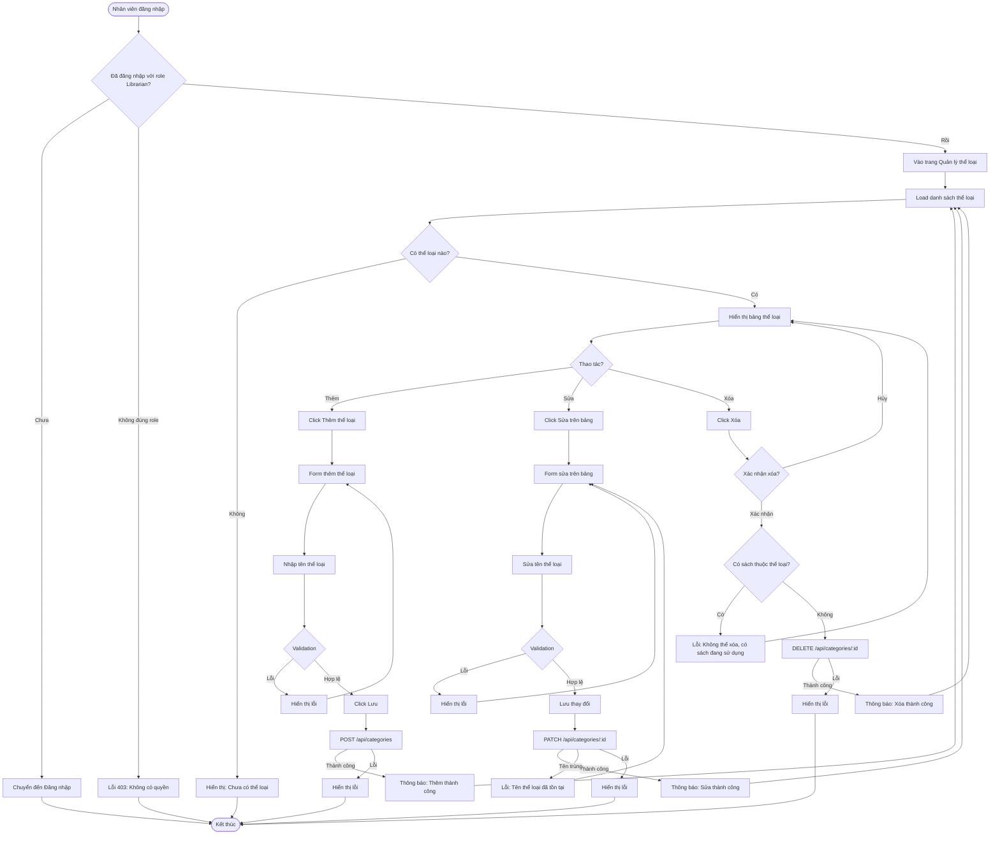

# 2.2.1 - Quản lý thể loại sách (Category Management)

## Tổng Quan
Luồng cho phép nhân viên thư viện quản lý (thêm, sửa, xóa) các thể loại sách.

## Actor
- Nhân viên thư viện (Librarian) - cần đăng nhập

## Mermaid Flowchart



## Các Bước Chi Tiết

### 1. Truy cập trang quản lý thể loại
- Nhân viên đăng nhập với role Librarian
- Vào trang "Quản lý thể loại" (`/librarian/categories`)

### 2. Xem danh sách thể loại
- Hiển thị bảng với các cột: ID, Tên thể loại, Số lượng sách, Thao tác
- Có thể sửa trực tiếp trên bảng (inline editing)

### 3. Thêm thể loại mới
- Click "Thêm thể loại"
- Nhập tên thể loại
- Validate: Tên không được để trống, tối đa 50 ký tự
- Lưu vào database

### 4. Sửa thể loại
- Click vào ô tên thể loại trên bảng
- Sửa trực tiếp
- Validate: Tên không được để trống, không trùng với thể loại khác
- Lưu thay đổi

### 5. Xóa thể loại
- Click "Xóa" trên bảng
- Xác nhận trong modal
- Kiểm tra: Không có sách nào thuộc thể loại này
- Nếu có sách: Không cho xóa, hiển thị cảnh báo
- Nếu không có: Xóa khỏi database

## Validation Rules

| Field | Rules |
|-------|-------|
| Tên thể loại | - Không được để trống<br>- Tối đa 50 ký tự<br>- Không được trùng với thể loại khác |

## API Endpoints

| Method | Endpoint | Description |
|--------|----------|-------------|
| GET | `/api/categories` | Lấy danh sách thể loại |
| POST | `/api/categories` | Thêm thể loại mới |
| PATCH | `/api/categories/:id` | Sửa thể loại |
| DELETE | `/api/categories/:id` | Xóa thể loại |

## Request Body

### Create Category
```json
{
  "name": "Khoa học viễn tưởng"
}
```

### Update Category
```json
{
  "name": "Khoa học viễn tưởng (Cập nhật)"
}
```

## Response

### Success (200/201)
```json
{
  "message": "Thêm thể loại thành công",
  "data": {
    "id": 1,
    "name": "Khoa học viễn tưởng",
    "bookCount": 0
  }
}
```

## Error Handling

| Lỗi | Thông báo | Status Code |
|-----|-----------|-------------|
| Chưa đăng nhập | "Vui lòng đăng nhập" | 401 |
| Không có quyền Librarian | "Bạn không có quyền truy cập" | 403 |
| Tên để trống | "Tên thể loại không được để trống" | 400 |
| Tên quá dài | "Tên thể loại không được quá 50 ký tự" | 400 |
| Tên trùng lặp | "Tên thể loại đã tồn tại" | 400 |
| Có sách đang sử dụng | "Không thể xóa, có sách đang sử dụng thể loại này" | 400 |
| Thể loại không tồn tại | "Thể loại không tồn tại" | 404 |

