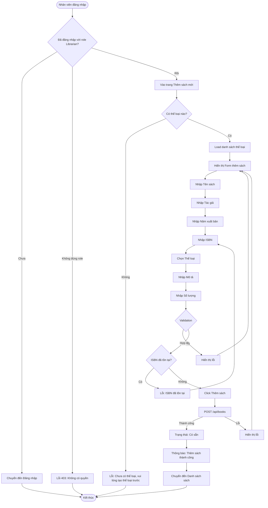

# 2.2.2 - Thêm Sách Mới (Add New Book)

## Tổng Quan
Luồng cho phép nhân viên thư viện thêm sách mới vào hệ thống.

## Actor
- Nhân viên thư viện (Librarian) - cần đăng nhập

## Mermaid Flowchart



## Các Bước Chi Tiết

### 1. Truy cập trang thêm sách
- Nhân viên đăng nhập với role Librarian
- Vào trang "Thêm sách mới" (`/librarian/books/add`)

### 2. Kiểm tra thể loại
- Kiểm tra có thể loại nào trong hệ thống chưa
- Nếu chưa có: Yêu cầu tạo thể loại trước

### 3. Điền form thêm sách
Form bao gồm:
- **Tên sách**: Bắt buộc, tối đa 100 ký tự
- **Tác giả**: Bắt buộc, tối đa 100 ký tự
- **Năm xuất bản**: 1900 - năm hiện tại
- **ISBN**: Định dạng ISBN-10 hoặc ISBN-13 (optional)
- **Thể loại**: Chọn từ dropdown (bắt buộc)
- **Mô tả**: Bắt buộc, tối đa 255 ký tự
- **Số lượng**: > 0, kiểu số

### 4. Validation
- Validate tất cả các trường
- Kiểm tra ISBN đã tồn tại chưa (nếu có)
- Kiểm tra thể loại có tồn tại không

### 5. Tạo sách
- Lưu vào database
- Trạng thái: "Có sẵn"
- Số lượng có sẵn = Số lượng nhập
- Số lượng đang mượn = 0

### 6. Thông báo kết quả
- Thành công: "Thêm sách thành công"
- Lỗi: Hiển thị lỗi cụ thể

## Validation Rules

| Field | Rules |
|-------|-------|
| Tên sách | - Không được để trống<br>- Tối đa 100 ký tự |
| Tác giả | - Không được để trống<br>- Tối đa 100 ký tự |
| Năm xuất bản | - Năm hợp lệ (1900 - năm hiện tại) |
| ISBN | - Định dạng chuẩn ISBN-10 hoặc ISBN-13 (nếu có)<br>- Không được trùng với sách khác |
| Thể loại | - Phải chọn từ danh sách<br>- Thể loại phải tồn tại |
| Mô tả | - Không được để trống<br>- Tối đa 255 ký tự |
| Số lượng | - Phải > 0<br>- Kiểu số |

## API Endpoints

| Method | Endpoint | Description |
|--------|----------|-------------|
| GET | `/api/categories` | Lấy danh sách thể loại (để chọn) |
| POST | `/api/books` | Thêm sách mới |

## Request Body

```json
{
  "title": "Harry Potter và Hòn đá Phù thủy",
  "author": "J.K. Rowling",
  "year": 1997,
  "isbn": "978-0-7475-3269-6",
  "categoryId": 1,
  "description": "Câu chuyện về cậu bé phù thủy Harry Potter...",
  "quantity": 10
}
```

## Response

### Success (201)
```json
{
  "message": "Thêm sách thành công",
  "data": {
    "id": 1,
    "title": "Harry Potter và Hòn đá Phù thủy",
    "author": "J.K. Rowling",
    "year": 1997,
    "isbn": "978-0-7475-3269-6",
    "categoryId": 1,
    "description": "Câu chuyện về cậu bé phù thủy Harry Potter...",
    "quantity": 10,
    "available": 10,
    "borrowed": 0,
    "status": "available"
  }
}
```

## Error Handling

| Lỗi | Thông báo | Status Code |
|-----|-----------|-------------|
| Chưa đăng nhập | "Vui lòng đăng nhập" | 401 |
| Không có quyền Librarian | "Bạn không có quyền truy cập" | 403 |
| Chưa có thể loại | "Chưa có thể loại, vui lòng tạo thể loại trước" | 400 |
| Tên sách để trống | "Tên sách không được để trống" | 400 |
| Tên sách quá dài | "Tên sách không được quá 100 ký tự" | 400 |
| Tác giả để trống | "Tác giả không được để trống" | 400 |
| Năm xuất bản không hợp lệ | "Năm xuất bản phải từ 1900 đến năm hiện tại" | 400 |
| ISBN không đúng định dạng | "ISBN không đúng định dạng" | 400 |
| ISBN đã tồn tại | "ISBN này đã được sử dụng" | 400 |
| Thể loại không tồn tại | "Thể loại không tồn tại" | 400 |
| Mô tả để trống | "Mô tả không được để trống" | 400 |
| Mô tả quá dài | "Mô tả không được quá 255 ký tự" | 400 |
| Số lượng <= 0 | "Số lượng phải lớn hơn 0" | 400 |

