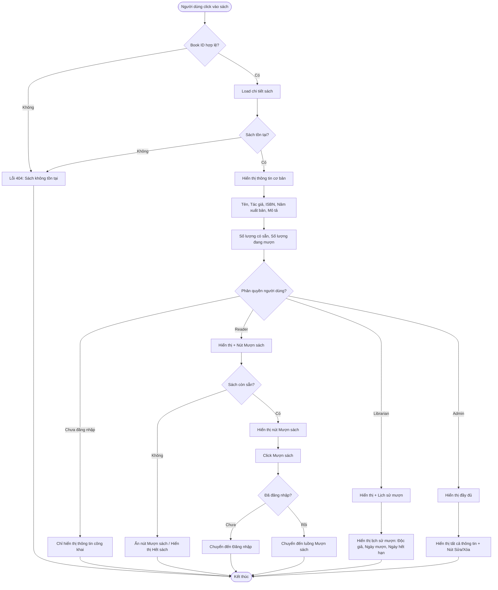

# 2.2.4 - Xem Chi Tiết Sách (Book Details)

## Tổng Quan
Luồng cho phép tất cả người dùng (kể cả chưa đăng nhập) xem chi tiết thông tin sách.

## Actor
- Tất cả người dùng (không cần đăng nhập)

## Mermaid Flowchart



## Các Bước Chi Tiết

### 1. Truy cập trang chi tiết
- Người dùng click vào sách từ danh sách
- URL: `/books/:id`

### 2. Load chi tiết sách
- Gọi API: `GET /api/books/:id`
- Kiểm tra sách có tồn tại không

### 3. Hiển thị thông tin cơ bản
**Thông tin công khai:**
- Tên sách
- Tác giả
- ISBN
- Năm xuất bản
- Mô tả chi tiết
- Số lượng bản đang có
- Số lượng đang mượn

### 4. Hiển thị theo quyền

#### Chưa đăng nhập:
- Chỉ hiển thị thông tin công khai
- Không có nút "Mượn sách"

#### Độc giả (Reader):
- Hiển thị thông tin công khai
- Nút "Mượn sách" (nếu sách còn sẵn)
- Nếu hết sách: Hiển thị "Hết sách"

#### Nhân viên (Librarian):
- Hiển thị thông tin công khai
- Hiển thị lịch sử mượn:
  - Độc giả
  - Ngày mượn
  - Ngày hết hạn

#### Quản lý viên (Admin):
- Hiển thị tất cả thông tin
- Nút "Sửa" và "Xóa"

### 5. Thao tác
- **Mượn sách:** Chỉ hiển thị nếu là Reader và sách còn sẵn
- **Sửa/Xóa:** Chỉ hiển thị nếu là Librarian/Admin

## API Endpoints

| Method | Endpoint | Description |
|--------|----------|-------------|
| GET | `/api/books/:id` | Lấy chi tiết sách |

## Response

### Success (200)
```json
{
  "data": {
    "id": 1,
    "title": "Harry Potter và Hòn đá Phù thủy",
    "author": "J.K. Rowling",
    "isbn": "978-0-7475-3269-6",
    "year": 1997,
    "description": "Câu chuyện về cậu bé phù thủy Harry Potter...",
    "category": {
      "id": 1,
      "name": "Khoa học viễn tưởng"
    },
    "quantity": 10,
    "available": 5,
    "borrowed": 3,
    "status": "available",
    "borrowHistory": [
      {
        "readerName": "Nguyễn Văn A",
        "borrowDate": "2024-01-15",
        "dueDate": "2024-01-29"
      }
    ]
  }
}
```

## Error Handling

| Lỗi | Thông báo | Status Code |
|-----|-----------|-------------|
| ID không hợp lệ | "ID sách không hợp lệ" | 400 |
| Sách không tồn tại | "Không tìm thấy sách" | 404 |
| Sách đã bị xóa | "Sách đã bị xóa" | 404 |
| Mất kết nối | "Không thể tải thông tin sách" | - |

