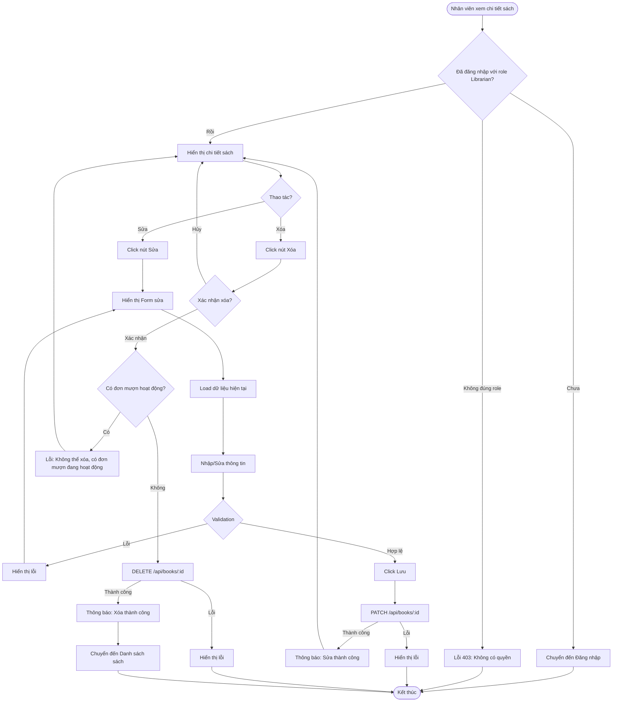

# 2.2.5 - Sửa & Xóa Sách (Edit & Delete Book)

## Tổng Quan
Luồng cho phép nhân viên thư viện sửa và xóa sách trong hệ thống.

## Actor
- Nhân viên thư viện (Librarian) - cần đăng nhập

## Mermaid Flowchart



## Các Bước Chi Tiết

### 1. Truy cập trang chi tiết sách
- Nhân viên đăng nhập với role Librarian
- Vào trang chi tiết sách (`/books/:id`)
- Hiển thị nút "Sửa" và "Xóa"

### 2. Sửa sách

#### a. Click "Sửa"
- Hiển thị form chỉnh sửa với dữ liệu hiện tại
- Các trường có thể sửa:
  - Tên sách
  - Tác giả
  - Năm xuất bản
  - ISBN
  - Thể loại
  - Mô tả
  - Số lượng (có thể tăng, không thể giảm xuống dưới số đang mượn)

#### b. Chỉnh sửa thông tin
- Nhập/sửa các trường
- Validation tương tự như thêm sách

#### c. Lưu thay đổi
- Gọi API: `PATCH /api/books/:id`
- Cập nhật vào database
- Thông báo thành công

### 3. Xóa sách

#### a. Click "Xóa"
- Hiển thị modal xác nhận:
  - "Bạn có chắc muốn xóa sách này?"
  - "Hành động này không thể hoàn tác"

#### b. Xác nhận
- Kiểm tra: Có đơn mượn đang hoạt động không?
  - Nếu có: Không cho xóa, hiển thị cảnh báo
  - Nếu không: Tiếp tục xóa

#### c. Xóa sách
- Gọi API: `DELETE /api/books/:id`
- Xóa khỏi database
- Thông báo thành công
- Chuyển về danh sách sách

## Validation Rules

| Field | Rules |
|-------|-------|
| Tên sách | - Không được để trống<br>- Tối đa 100 ký tự |
| Tác giả | - Không được để trống<br>- Tối đa 100 ký tự |
| Năm xuất bản | - Năm hợp lệ (1900 - năm hiện tại) |
| ISBN | - Định dạng chuẩn ISBN-10 hoặc ISBN-13 (nếu có)<br>- Không được trùng với sách khác (trừ chính nó) |
| Thể loại | - Phải chọn từ danh sách |
| Mô tả | - Không được để trống<br>- Tối đa 255 ký tự |
| Số lượng | - Phải >= số lượng đang mượn<br>- Kiểu số |

## API Endpoints

| Method | Endpoint | Description |
|--------|----------|-------------|
| GET | `/api/books/:id` | Lấy chi tiết sách |
| PATCH | `/api/books/:id` | Sửa sách |
| DELETE | `/api/books/:id` | Xóa sách |

## Request Body

### Update Book
```json
{
  "title": "Harry Potter và Hòn đá Phù thủy (Cập nhật)",
  "author": "J.K. Rowling",
  "year": 1997,
  "isbn": "978-0-7475-3269-6",
  "categoryId": 1,
  "description": "Câu chuyện về cậu bé phù thủy Harry Potter...",
  "quantity": 15
}
```

## Response

### Success (200)
```json
{
  "message": "Sửa sách thành công",
  "data": {
    "id": 1,
    "title": "Harry Potter và Hòn đá Phù thủy (Cập nhật)",
    ...
  }
}
```

## Error Handling

| Lỗi | Thông báo | Status Code |
|-----|-----------|-------------|
| Chưa đăng nhập | "Vui lòng đăng nhập" | 401 |
| Không có quyền Librarian | "Bạn không có quyền truy cập" | 403 |
| Sách không tồn tại | "Không tìm thấy sách" | 404 |
| Sách đã bị xóa | "Sách đã bị xóa" | 404 |
| Có đơn mượn hoạt động | "Không thể xóa, có đơn mượn đang hoạt động" | 400 |
| Số lượng < số đang mượn | "Số lượng không thể nhỏ hơn số sách đang mượn" | 400 |
| Dữ liệu không hợp lệ | "Dữ liệu không hợp lệ" | 400 |

