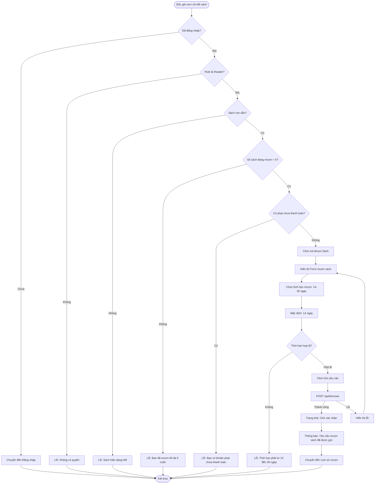

# 2.3.1 - Mượn Sách (Độc Giả) (Borrow Book - Reader)

## Tổng Quan
Luồng cho phép độc giả yêu cầu mượn sách từ thư viện.

## Actor
- Độc giả (Reader) - cần đăng nhập

## Mermaid Flowchart



## Các Bước Chi Tiết

### 1. Kiểm tra điều kiện mượn sách
Trước khi cho phép mượn, hệ thống kiểm tra:

#### a. Đã đăng nhập
- Phải đăng nhập với role Reader
- Nếu chưa: Chuyển đến trang đăng nhập

#### b. Sách còn sẵn
- `book.available > 0`
- Nếu không: Hiển thị "Sách hiện đang hết, vui lòng thử lại sau"

#### c. Số sách đang mượn
- Kiểm tra số sách đang mượn của độc giả
- Giới hạn: Tối đa 5 cuốn
- Nếu vượt: "Bạn đã mượn tối đa 5 cuốn sách"

#### d. Khoản phạt chưa thanh toán
- Kiểm tra có phiếu phạt nào ở trạng thái "Chưa thanh toán" không
- Nếu có: "Bạn có khoản phạt chưa thanh toán, vui lòng thanh toán trước khi mượn sách mới"

### 2. Form chọn thời hạn mượn
- Mặc định: 14 ngày
- Tối đa: 30 ngày
- Input: Date picker hoặc dropdown

### 3. Gửi yêu cầu mượn
- API: `POST /api/borrows`
- Body:
  ```json
  {
    "bookId": 1,
    "duration": 14
  }
  ```

### 4. Tạo đơn mượn
- Trạng thái: "Chờ xác nhận" (Pending)
- Ngày mượn: null (chờ nhân viên xác nhận)
- Ngày hết hạn: Tính từ ngày mượn + duration

### 5. Thông báo kết quả
- Thành công: "Yêu cầu mượn sách đã được gửi, vui lòng đợi nhân viên xác nhận"
- Lỗi: Hiển thị lỗi cụ thể

## Validation Rules

| Điều kiện | Kiểm tra |
|-----------|----------|
| Sách còn sẵn | `book.available > 0` |
| Số sách đang mượn | `user.borrowedBooks.length < 5` |
| Không có phạt chưa trả | `user.pendingFines.length === 0` |
| Thời hạn mượn | `14 <= duration <= 30` |

## API Endpoints

| Method | Endpoint | Description |
|--------|----------|-------------|
| POST | `/api/borrows` | Tạo yêu cầu mượn sách |
| GET | `/api/borrows/my-borrows` | Lấy danh sách sách đang mượn |

## Request Body

```json
{
  "bookId": 1,
  "duration": 14
}
```

## Response

### Success (201)
```json
{
  "message": "Yêu cầu mượn sách đã được gửi",
  "data": {
    "id": 1,
    "bookId": 1,
    "userId": 1,
    "status": "pending",
    "requestDate": "2024-01-15T10:00:00Z",
    "duration": 14
  }
}
```

## Error Handling

| Lỗi | Thông báo | Status Code |
|-----|-----------|-------------|
| Chưa đăng nhập | "Vui lòng đăng nhập" | 401 |
| Không có quyền Reader | "Bạn không có quyền mượn sách" | 403 |
| Sách hết | "Sách hiện đang hết" | 400 |
| Đã mượn tối đa | "Bạn đã mượn tối đa 5 cuốn sách" | 400 |
| Có phạt chưa trả | "Bạn có khoản phạt chưa thanh toán" | 400 |
| Thời hạn không hợp lệ | "Thời hạn mượn phải từ 14 đến 30 ngày" | 400 |
| Sách không tồn tại | "Không tìm thấy sách" | 404 |

