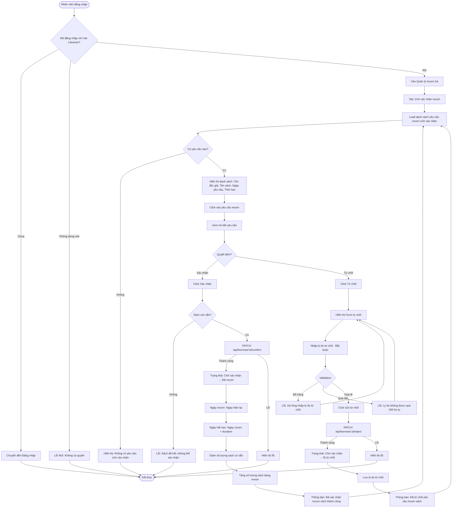

# 2.3.2 - Mượn Sách (Nhân Viên) (Confirm/Reject Borrow - Librarian)

## Tổng Quan
Luồng cho phép nhân viên thư viện xác nhận hoặc từ chối yêu cầu mượn sách của độc giả.

## Actor
- Nhân viên thư viện (Librarian) - cần đăng nhập

## Mermaid Flowchart



## Các Bước Chi Tiết

### 1. Xem danh sách yêu cầu mượn chờ xác nhận
- Nhân viên vào "Quản lý mượn trả" → Tab "Chờ xác nhận mượn"
- API: `GET /api/borrows?status=pending`
- Hiển thị:
  - Tên độc giả
  - Tên sách
  - Ngày yêu cầu
  - Thời hạn mượn yêu cầu

### 2. Xác nhận mượn sách

#### a. Click "Xác nhận"
- API: `PATCH /api/borrows/:id/confirm`
- Body: (không cần, chỉ cần ID)

#### b. Xử lý
- Kiểm tra lại sách còn sẵn không
- Cập nhật trạng thái: "pending" → "borrowed"
- Cập nhật ngày mượn: Ngày hiện tại
- Tính ngày hết hạn: Ngày mượn + duration
- Giảm `book.available` đi 1
- Tăng `book.borrowed` lên 1

#### c. Thông báo
- Thành công: "Đã xác nhận mượn sách thành công"
- Gửi thông báo cho độc giả (nếu có hệ thống notification)

### 3. Từ chối mượn sách

#### a. Click "Từ chối"
- Hiển thị modal/form nhập lý do

#### b. Nhập lý do từ chối
- Bắt buộc phải nhập
- Tối đa 500 ký tự
- Validation: Không được để trống

#### c. Xử lý
- API: `PATCH /api/borrows/:id/reject`
- Body:
  ```json
  {
    "reason": "Lý do từ chối"
  }
  ```
- Cập nhật trạng thái: "pending" → "rejected"
- Lưu lý do từ chối

#### d. Thông báo
- Thành công: "Đã từ chối yêu cầu mượn sách"
- Gửi thông báo cho độc giả kèm lý do

## Validation Rules

| Field | Rules |
|-------|-------|
| Lý do từ chối | - Bắt buộc<br>- Tối đa 500 ký tự<br>- Không được để trống |

## API Endpoints

| Method | Endpoint | Description |
|--------|----------|-------------|
| GET | `/api/borrows?status=pending` | Lấy danh sách yêu cầu chờ xác nhận |
| PATCH | `/api/borrows/:id/confirm` | Xác nhận mượn sách |
| PATCH | `/api/borrows/:id/reject` | Từ chối mượn sách |

## Request Body (Reject)

```json
{
  "reason": "Sách đang được sửa chữa"
}
```

## Response

### Success (200)
```json
{
  "message": "Đã xác nhận mượn sách thành công",
  "data": {
    "id": 1,
    "status": "borrowed",
    "borrowDate": "2024-01-15T10:00:00Z",
    "dueDate": "2024-01-29T10:00:00Z"
  }
}
```

## Error Handling

| Lỗi | Thông báo | Status Code |
|-----|-----------|-------------|
| Chưa đăng nhập | "Vui lòng đăng nhập" | 401 |
| Không có quyền Librarian | "Bạn không có quyền truy cập" | 403 |
| Không tìm thấy đơn mượn | "Không tìm thấy yêu cầu mượn sách" | 404 |
| Đã được xử lý | "Yêu cầu này đã được xử lý" | 400 |
| Sách đã hết | "Sách đã hết, không thể xác nhận" | 400 |
| Lý do từ chối để trống | "Vui lòng nhập lý do từ chối" | 400 |
| Lý do từ chối quá dài | "Lý do không được quá 500 ký tự" | 400 |

