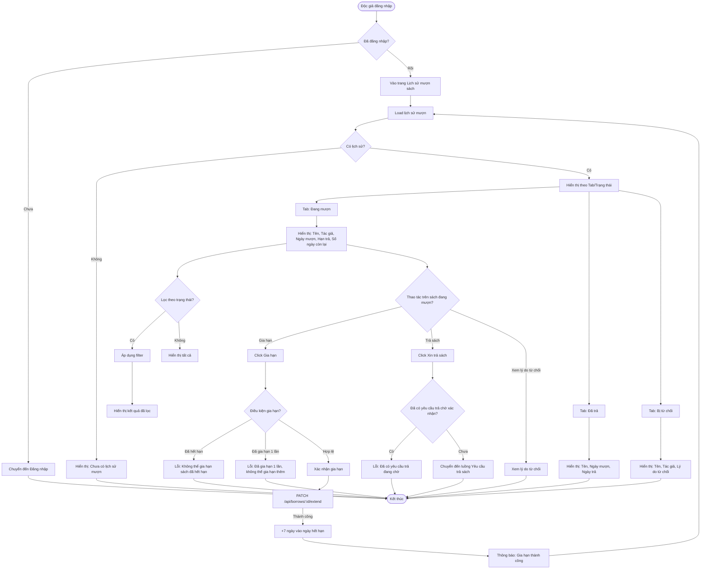

# 2.3.3 - Xem Lịch Sử Mượn Sách (Borrow History)

## Tổng Quan
Luồng cho phép độc giả xem lịch sử mượn sách, gia hạn và yêu cầu trả sách.

## Actor
- Độc giả (Reader) - cần đăng nhập

## Mermaid Flowchart



## Các Bước Chi Tiết

### 1. Truy cập trang lịch sử mượn
- Độc giả đăng nhập
- Vào trang "Lịch sử mượn sách" (`/reader/borrows`)

### 2. Hiển thị lịch sử theo tab/trạng thái

#### Tab "Đang mượn":
- Hiển thị sách đang mượn với trạng thái: "Chờ xác nhận", "Đang mượn", "Quá hạn"
- Thông tin: Tên sách, Tác giả, Ngày mượn, Hạn trả, Số ngày còn lại
- Có nút "Gia hạn" và "Xin trả sách"

#### Tab "Đã trả":
- Hiển thị sách đã trả
- Thông tin: Tên sách, Ngày mượn, Ngày trả

#### Tab "Bị từ chối":
- Hiển thị sách bị từ chối
- Thông tin: Tên sách, Tác giả, Lý do từ chối

### 3. Lọc theo trạng thái
- Dropdown lọc: Tất cả / Chờ xác nhận / Đang mượn / Quá hạn / Đã trả / Bị từ chối
- API: `GET /api/borrows/my-borrows?status=borrowed`

### 4. Gia hạn sách
- Click "Gia hạn" trên sách đang mượn
- Điều kiện:
  - Chưa hết hạn
  - Chưa gia hạn lần nào (tối đa 1 lần)
- Thêm 7 ngày vào ngày hết hạn
- API: `PATCH /api/borrows/:id/extend`

### 5. Yêu cầu trả sách
- Click "Xin trả sách"
- Kiểm tra: Chưa có yêu cầu trả chờ xác nhận
- Chuyển đến luồng Yêu cầu trả sách

## API Endpoints

| Method | Endpoint | Description |
|--------|----------|-------------|
| GET | `/api/borrows/my-borrows` | Lấy lịch sử mượn của độc giả |
| GET | `/api/borrows/my-borrows?status=borrowed` | Lấy sách đang mượn |
| PATCH | `/api/borrows/:id/extend` | Gia hạn sách |

## Response

### Success (200)
```json
{
  "data": {
    "borrowed": [
      {
        "id": 1,
        "book": {
          "title": "Harry Potter",
          "author": "J.K. Rowling"
        },
        "borrowDate": "2024-01-15",
        "dueDate": "2024-01-29",
        "daysRemaining": 5,
        "status": "borrowed"
      }
    ],
    "returned": [...],
    "rejected": [...]
  }
}
```

## Error Handling

| Lỗi | Thông báo | Status Code |
|-----|-----------|-------------|
| Chưa đăng nhập | "Vui lòng đăng nhập" | 401 |
| Token hết hạn | "Phiên đăng nhập đã hết hạn" | 401 |
| Đã gia hạn 1 lần | "Đã gia hạn 1 lần, không thể gia hạn thêm" | 400 |
| Đã hết hạn | "Không thể gia hạn sách đã hết hạn" | 400 |
| Đã có yêu cầu trả | "Đã có yêu cầu trả sách đang chờ xác nhận" | 400 |

