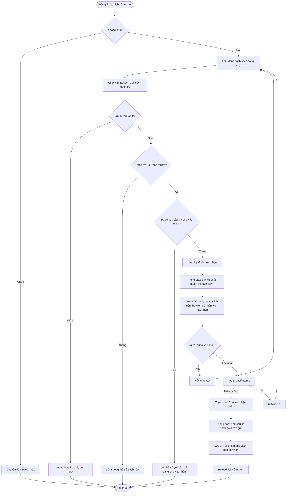

# 2.4.1 - Yêu Cầu Trả Sách (Return Request)

## Tổng Quan
Luồng cho phép độc giả yêu cầu trả sách đang mượn.

## Actor
- Độc giả (Reader) - cần đăng nhập

## Mermaid Flowchart



## Các Bước Chi Tiết

### 1. Truy cập trang lịch sử mượn
- Độc giả đăng nhập
- Vào trang "Lịch sử mượn sách" (`/reader/borrows`)
- Xem danh sách sách đang mượn

### 2. Click "Xin trả sách"
- Click nút "Xin trả sách" trên sách muốn trả
- Kiểm tra điều kiện:
  - Đơn mượn tồn tại
  - Đơn mượn ở trạng thái "Đang mượn"
  - Chưa có yêu cầu trả chờ xác nhận

### 3. Xác nhận trong modal
- Hiển thị modal:
  - "Bạn có chắc muốn trả sách này?"
  - "Vui lòng mang sách đến thư viện để nhân viên xác nhận"
- Nút "Xác nhận" và "Hủy"

### 4. Tạo yêu cầu trả sách
- API: `POST /api/returns`
- Body:
  ```json
  {
    "borrowId": 1
  }
  ```
- Tạo return request với trạng thái: "pending"

### 5. Thông báo kết quả
- Thành công: "Yêu cầu trả sách đã được gửi. Vui lòng mang sách đến thư viện để nhân viên xác nhận."
- Lỗi: Hiển thị lỗi cụ thể

## Validation Rules

| Điều kiện | Kiểm tra |
|-----------|----------|
| Đơn mượn tồn tại | `borrowId` phải hợp lệ |
| Đơn mượn đang ở trạng thái "borrowed" | `borrow.status === 'borrowed'` |
| Chưa có yêu cầu trả chờ xác nhận | `returnRequest.status !== 'pending'` |
| Đơn mượn thuộc về người dùng | `borrow.userId === currentUserId` |

## API Endpoints

| Method | Endpoint | Description |
|--------|----------|-------------|
| POST | `/api/returns` | Tạo yêu cầu trả sách |
| GET | `/api/borrows/my-borrows?status=borrowed` | Lấy danh sách sách đang mượn |

## Request Body

```json
{
  "borrowId": 1
}
```

## Response

### Success (201)
```json
{
  "message": "Yêu cầu trả sách đã được gửi",
  "data": {
    "id": 1,
    "borrowId": 1,
    "status": "pending",
    "requestDate": "2024-01-20T10:00:00Z"
  }
}
```

## Error Handling

| Lỗi | Thông báo | Status Code |
|-----|-----------|-------------|
| Chưa đăng nhập | "Vui lòng đăng nhập" | 401 |
| Không tìm thấy đơn mượn | "Không tìm thấy đơn mượn sách" | 404 |
| Đơn mượn không phải của bạn | "Bạn không có quyền trả sách này" | 403 |
| Đã có yêu cầu trả | "Đã có yêu cầu trả sách đang chờ xác nhận" | 400 |
| Đơn mượn không ở trạng thái hợp lệ | "Không thể trả sách này" | 400 |
| Mất kết nối | "Không thể tạo yêu cầu trả sách" | - |

