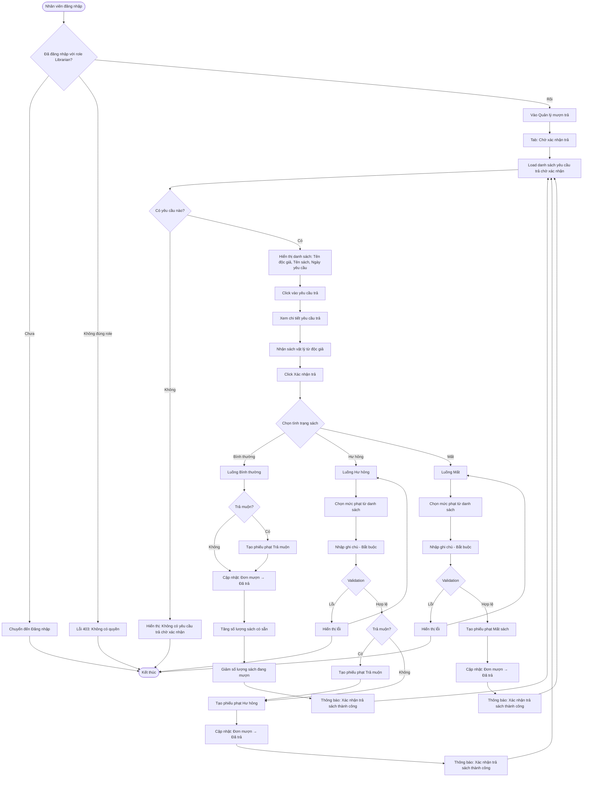

# 2.4.2 - Xác Nhận Trả Sách (Confirm Return)

## Tổng Quan
Luồng cho phép nhân viên thư viện xác nhận trả sách với 3 tình trạng: Bình thường, Hư hỏng, Mất.

## Actor
- Nhân viên thư viện (Librarian) - cần đăng nhập

## Mermaid Flowchart



## Các Bước Chi Tiết

### 1. Xem danh sách yêu cầu trả chờ xác nhận
- Nhân viên vào "Quản lý mượn trả" → Tab "Chờ xác nhận trả"
- API: `GET /api/returns?status=pending`
- Hiển thị:
  - Tên độc giả
  - Tên sách
  - Ngày yêu cầu trả

### 2. Nhận sách vật lý
- Nhân viên nhận sách từ độc giả
- Kiểm tra tình trạng sách

### 3. Xác nhận trả sách - Bình thường

#### a. Chọn tình trạng: "Bình thường"
- Không cần chọn mức phạt
- Không cần nhập ghi chú

#### b. Kiểm tra trả muộn
- Nếu trả muộn: Tạo phiếu phạt "Trả muộn"
- Nếu đúng hạn: Không tạo phạt

#### c. Cập nhật
- Đơn mượn: "Đã trả"
- Tăng `book.available`
- Giảm `book.borrowed`

### 4. Xác nhận trả sách - Hư hỏng

#### a. Chọn tình trạng: "Hư hỏng"
- Bắt buộc chọn mức phạt
- Bắt buộc nhập ghi chú

#### b. Kiểm tra trả muộn
- Nếu trả muộn: Tạo phiếu phạt "Trả muộn"
- Tạo phiếu phạt "Hư hỏng"

#### c. Cập nhật
- Đơn mượn: "Đã trả"
- Tăng `book.available` (sách vẫn còn, chỉ hư hỏng)
- Giảm `book.borrowed`

### 5. Xác nhận trả sách - Mất

#### a. Chọn tình trạng: "Mất"
- Bắt buộc chọn mức phạt
- Bắt buộc nhập ghi chú

#### b. Tạo phiếu phạt
- Tạo phiếu phạt "Mất sách"
- Không tạo phạt trả muộn (vì sách đã mất)

#### c. Cập nhật
- Đơn mượn: "Đã trả"
- Không tăng `book.available` (sách đã mất)
- Giảm `book.borrowed`
- Giảm `book.quantity` (tổng số lượng)

## Validation Rules

| Field | Rules |
|-------|-------|
| Tình trạng sách | - Bắt buộc chọn (bình thường, hư hỏng, mất) |
| Mức phạt | - Bắt buộc khi tình trạng là "hư hỏng" hoặc "mất" |
| Ghi chú | - Bắt buộc khi tình trạng là "hư hỏng" hoặc "mất"<br>- Tối đa 500 ký tự |

## API Endpoints

| Method | Endpoint | Description |
|--------|----------|-------------|
| GET | `/api/returns?status=pending` | Lấy danh sách yêu cầu trả chờ xác nhận |
| PATCH | `/api/returns/:id/confirm` | Xác nhận trả sách |

## Request Body

```json
{
  "condition": "normal|damaged|lost",
  "fineLevelId": 1,
  "note": "Ghi chú về tình trạng sách"
}
```

## Response

### Success (200)
```json
{
  "message": "Xác nhận trả sách thành công",
  "data": {
    "id": 1,
    "borrowId": 1,
    "status": "returned",
    "condition": "normal",
    "returnDate": "2024-01-20T10:00:00Z"
  }
}
```

## Error Handling

| Lỗi | Thông báo | Status Code |
|-----|-----------|-------------|
| Chưa đăng nhập | "Vui lòng đăng nhập" | 401 |
| Không có quyền Librarian | "Bạn không có quyền truy cập" | 403 |
| Yêu cầu trả không tồn tại | "Không tìm thấy yêu cầu trả sách" | 404 |
| Yêu cầu trả đã được xử lý | "Yêu cầu này đã được xử lý" | 400 |
| Chưa chọn tình trạng | "Vui lòng chọn tình trạng sách" | 400 |
| Chưa chọn mức phạt | "Vui lòng chọn mức phạt" | 400 |
| Ghi chú để trống | "Vui lòng nhập ghi chú" | 400 |
| Ghi chú quá dài | "Ghi chú không được quá 500 ký tự" | 400 |
| Mức phạt không tồn tại | "Mức phạt không tồn tại" | 404 |

