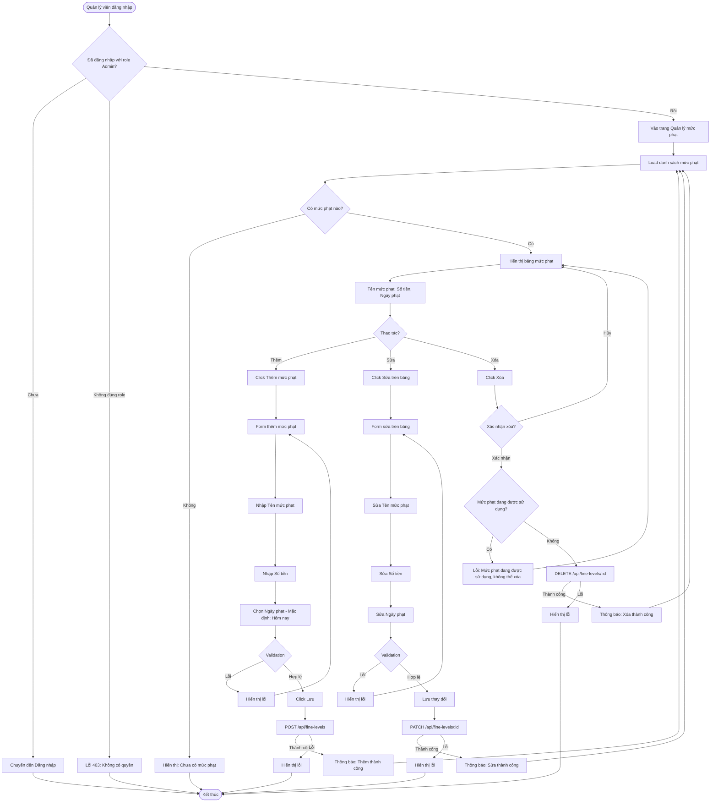

# 2.5.1 - Quản lý mức phạt (Fine Level Management)

## Tổng Quan
Luồng cho phép quản lý viên quản lý (thêm, sửa, xóa) các mức phạt trong hệ thống.

## Actor
- Quản lý viên (Admin) - cần đăng nhập

## Mermaid Flowchart



## Các Bước Chi Tiết

### 1. Truy cập trang quản lý mức phạt
- Quản lý viên đăng nhập với role Admin
- Vào trang "Quản lý mức phạt" (`/admin/fine-levels`)

### 2. Xem danh sách mức phạt
- Hiển thị bảng với các cột: ID, Tên mức phạt, Số tiền, Ngày phạt, Thao tác
- Có thể sửa trực tiếp trên bảng (inline editing)

### 3. Thêm mức phạt mới
- Click "Thêm mức phạt"
- Nhập:
  - Tên mức phạt (bắt buộc, tối đa 25 ký tự)
  - Số tiền (bắt buộc, > 0)
  - Ngày phạt (mặc định: ngày hiện tại)
- Validate và lưu

### 4. Sửa mức phạt
- Click vào ô trên bảng
- Sửa trực tiếp: Tên, Số tiền, Ngày phạt
- Validate và lưu

### 5. Xóa mức phạt
- Click "Xóa" trên bảng
- Xác nhận trong modal
- Kiểm tra: Mức phạt có đang được sử dụng không
- Nếu có: Không cho xóa, hiển thị cảnh báo
- Nếu không: Xóa khỏi database

## Validation Rules

| Field | Rules |
|-------|-------|
| Tên mức phạt | - Không được để trống<br>- Tối đa 25 ký tự |
| Số tiền | - Phải > 0<br>- Kiểu số |
| Ngày phạt | - Ngày hợp lệ<br>- Mặc định: ngày hiện tại |

## API Endpoints

| Method | Endpoint | Description |
|--------|----------|-------------|
| GET | `/api/fine-levels` | Lấy danh sách mức phạt |
| POST | `/api/fine-levels` | Thêm mức phạt mới |
| PATCH | `/api/fine-levels/:id` | Sửa mức phạt |
| DELETE | `/api/fine-levels/:id` | Xóa mức phạt |

## Request Body

### Create Fine Level
```json
{
  "name": "Hư hỏng nhẹ",
  "amount": 50000,
  "fineDate": "2024-01-15"
}
```

### Update Fine Level
```json
{
  "name": "Hư hỏng nhẹ (Cập nhật)",
  "amount": 60000,
  "fineDate": "2024-01-15"
}
```

## Response

### Success (200/201)
```json
{
  "message": "Thêm mức phạt thành công",
  "data": {
    "id": 1,
    "name": "Hư hỏng nhẹ",
    "amount": 50000,
    "fineDate": "2024-01-15"
  }
}
```

## Error Handling

| Lỗi | Thông báo | Status Code |
|-----|-----------|-------------|
| Chưa đăng nhập | "Vui lòng đăng nhập" | 401 |
| Không có quyền Admin | "Bạn không có quyền truy cập" | 403 |
| Tên để trống | "Tên mức phạt không được để trống" | 400 |
| Tên quá dài | "Tên mức phạt không được quá 25 ký tự" | 400 |
| Số tiền <= 0 | "Số tiền phải lớn hơn 0" | 400 |
| Ngày phạt không hợp lệ | "Ngày phạt không hợp lệ" | 400 |
| Mức phạt đang được sử dụng | "Không thể xóa, mức phạt đang được sử dụng" | 400 |
| Mức phạt không tồn tại | "Mức phạt không tồn tại" | 404 |

