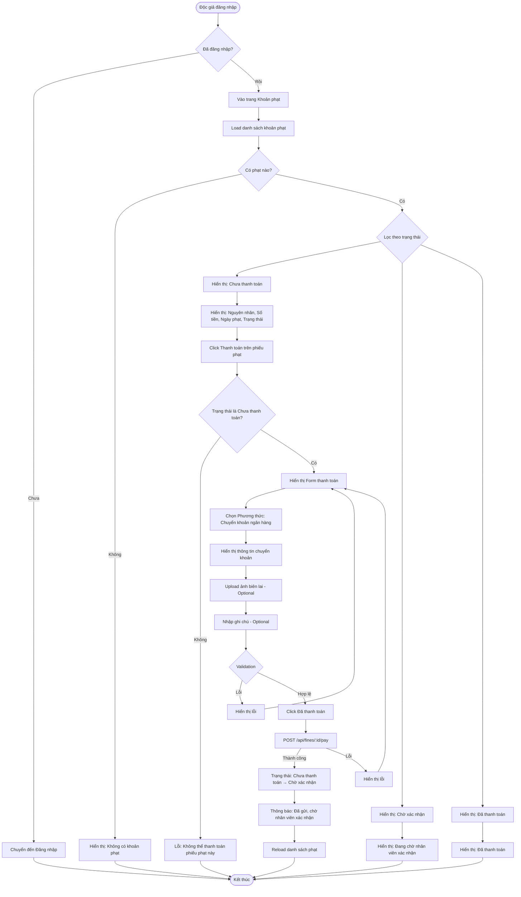

# 2.5.2 - Xem & Thanh Toán Phạt (Độc Giả) (View & Pay Fine - Reader)

## Tổng Quan
Luồng cho phép độc giả xem và thanh toán các khoản phạt.

## Actor
- Độc giả (Reader) - cần đăng nhập

## Mermaid Flowchart



## Các Bước Chi Tiết

### 1. Truy cập trang khoản phạt
- Độc giả đăng nhập
- Vào trang "Khoản phạt" (`/reader/fines`)

### 2. Xem danh sách khoản phạt
- API: `GET /api/fines/my-fines`
- Hiển thị theo trạng thái:
  - **Chưa thanh toán:** Nguyên nhân, Số tiền, Ngày phạt, Trạng thái
  - **Chờ xác nhận:** Đang chờ nhân viên xác nhận
  - **Đã thanh toán:** Đã thanh toán

### 3. Thanh toán phạt

#### a. Click "Thanh toán"
- Chỉ hiển thị trên phiếu phạt ở trạng thái "Chưa thanh toán"
- Click vào phiếu phạt muốn thanh toán

#### b. Form thanh toán
- **Phương thức:** Chuyển khoản ngân hàng (mặc định)
- **Thông tin chuyển khoản:** Hiển thị số tài khoản, ngân hàng
- **Upload ảnh biên lai:** Optional nhưng khuyến khích
- **Ghi chú:** Optional

#### c. Gửi yêu cầu xác nhận
- API: `POST /api/fines/:id/pay`
- Body:
  ```json
  {
    "paymentMethod": "bank_transfer",
    "receiptImage": "base64_or_url",
    "note": "Đã chuyển khoản ngày 20/01/2024"
  }
  ```
- Cập nhật trạng thái: "unpaid" → "pending_confirmation"

### 4. Thông báo kết quả
- Thành công: "Đã gửi yêu cầu thanh toán, vui lòng đợi nhân viên xác nhận"
- Lỗi: Hiển thị lỗi cụ thể

## Validation Rules

| Field | Rules |
|-------|-------|
| Ảnh biên lai | - Format: jpg, png, jpeg<br>- Max size: 5MB<br>- Optional |
| Ghi chú | - Optional<br>- Tối đa 500 ký tự |

## API Endpoints

| Method | Endpoint | Description |
|--------|----------|-------------|
| GET | `/api/fines/my-fines` | Lấy danh sách phạt của độc giả |
| GET | `/api/fines/my-fines?status=unpaid` | Lấy phạt chưa thanh toán |
| POST | `/api/fines/:id/pay` | Gửi yêu cầu thanh toán |

## Request Body

```json
{
  "paymentMethod": "bank_transfer",
  "receiptImage": "data:image/jpeg;base64,...",
  "note": "Đã chuyển khoản ngày 20/01/2024"
}
```

## Response

### Success (200)
```json
{
  "message": "Đã gửi yêu cầu thanh toán",
  "data": {
    "id": 1,
    "status": "pending_confirmation",
    "paymentDate": "2024-01-20T10:00:00Z"
  }
}
```

## Error Handling

| Lỗi | Thông báo | Status Code |
|-----|-----------|-------------|
| Chưa đăng nhập | "Vui lòng đăng nhập" | 401 |
| Phiếu phạt không tồn tại | "Không tìm thấy phiếu phạt" | 404 |
| Phiếu phạt không phải của bạn | "Bạn không có quyền thanh toán phiếu phạt này" | 403 |
| Phiếu phạt đã được thanh toán | "Phiếu phạt này đã được thanh toán" | 400 |
| Ảnh quá lớn | "Ảnh biên lai không được quá 5MB" | 400 |
| Định dạng ảnh không hợp lệ | "Định dạng ảnh không hợp lệ" | 400 |

