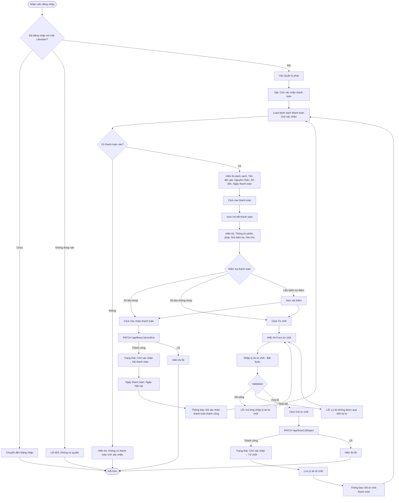

# 2.5.3 - Xem & Thanh Toán Phạt (Nhân Viên) (Confirm/Reject Payment - Librarian)

## Tổng Quan
Luồng cho phép nhân viên thư viện xác nhận hoặc từ chối thanh toán phạt của độc giả.

## Actor
- Nhân viên thư viện (Librarian) - cần đăng nhập

## Mermaid Flowchart



## Các Bước Chi Tiết

### 1. Xem danh sách thanh toán chờ xác nhận
- Nhân viên vào "Quản lý phạt" → Tab "Chờ xác nhận thanh toán"
- API: `GET /api/fines?status=pending_confirmation`
- Hiển thị:
  - Tên độc giả
  - Nguyên nhân phạt
  - Số tiền
  - Ngày thanh toán

### 2. Xem chi tiết thanh toán
- Click vào thanh toán
- Hiển thị:
  - Thông tin phiếu phạt (nguyên nhân, số tiền phạt)
  - Ảnh biên lai (nếu có)
  - Ghi chú của độc giả
  - Số tiền đã chuyển

### 3. Xác nhận thanh toán

#### a. Kiểm tra
- So sánh số tiền phạt với số tiền đã chuyển
- Kiểm tra ảnh biên lai (nếu có)
- Xem xét ghi chú

#### b. Click "Xác nhận thanh toán"
- API: `PATCH /api/fines/:id/confirm`
- Cập nhật trạng thái: "pending_confirmation" → "paid"
- Ghi nhận ngày thanh toán

#### c. Thông báo
- Thành công: "Đã xác nhận thanh toán thành công"
- Gửi thông báo cho độc giả (nếu có hệ thống notification)

### 4. Từ chối thanh toán

#### a. Click "Từ chối"
- Hiển thị form nhập lý do

#### b. Nhập lý do từ chối
- Bắt buộc phải nhập
- Tối đa 500 ký tự
- Validation: Không được để trống

#### c. Xử lý
- API: `PATCH /api/fines/:id/reject`
- Body:
  ```json
  {
    "reason": "Số tiền không khớp với số tiền phạt"
  }
  ```
- Cập nhật trạng thái: "pending_confirmation" → "rejected"
- Lưu lý do từ chối

#### d. Thông báo
- Thành công: "Đã từ chối thanh toán"
- Gửi thông báo cho độc giả kèm lý do

## Validation Rules

| Field | Rules |
|-------|-------|
| Lý do từ chối | - Bắt buộc<br>- Tối đa 500 ký tự<br>- Không được để trống |

## API Endpoints

| Method | Endpoint | Description |
|--------|----------|-------------|
| GET | `/api/fines?status=pending_confirmation` | Lấy danh sách chờ xác nhận |
| GET | `/api/fines/:id` | Lấy chi tiết phiếu phạt |
| PATCH | `/api/fines/:id/confirm` | Xác nhận thanh toán |
| PATCH | `/api/fines/:id/reject` | Từ chối thanh toán |

## Request Body (Reject)

```json
{
  "reason": "Số tiền không khớp với số tiền phạt"
}
```

## Response

### Success (200)
```json
{
  "message": "Đã xác nhận thanh toán thành công",
  "data": {
    "id": 1,
    "status": "paid",
    "paidDate": "2024-01-20T10:00:00Z"
  }
}
```

## Error Handling

| Lỗi | Thông báo | Status Code |
|-----|-----------|-------------|
| Chưa đăng nhập | "Vui lòng đăng nhập" | 401 |
| Không có quyền Librarian | "Bạn không có quyền truy cập" | 403 |
| Thanh toán không tồn tại | "Không tìm thấy thanh toán" | 404 |
| Thanh toán đã được xử lý | "Thanh toán này đã được xử lý" | 400 |
| Lý do từ chối để trống | "Vui lòng nhập lý do từ chối" | 400 |
| Lý do từ chối quá dài | "Lý do không được quá 500 ký tự" | 400 |

