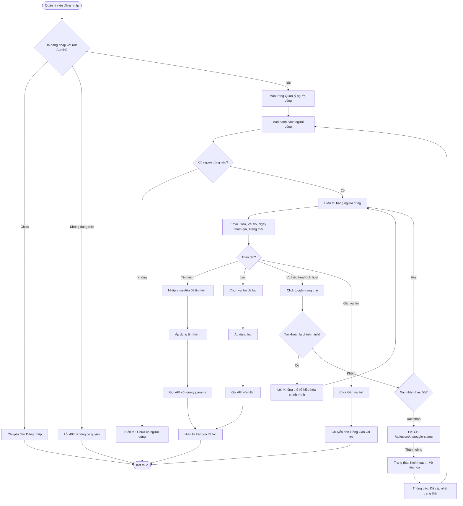

# 2.6.1 - Danh Sách Người Dùng (User List)

## Tổng Quan
Luồng cho phép quản lý viên xem danh sách người dùng, tìm kiếm, lọc và vô hiệu hóa/kích hoạt tài khoản.

## Actor
- Quản lý viên (Admin) - cần đăng nhập

## Mermaid Flowchart



## Các Bước Chi Tiết

### 1. Truy cập trang quản lý người dùng
- Quản lý viên đăng nhập với role Admin
- Vào trang "Quản lý người dùng" (`/admin/users`)

### 2. Xem danh sách người dùng
- API: `GET /api/users`
- Hiển thị bảng với các cột:
  - Email
  - Tên
  - Vai trò (Reader/Librarian/Admin)
  - Ngày tham gia
  - Trạng thái (Kích hoạt/Vô hiệu hóa)

### 3. Tìm kiếm
- Input: Email hoặc tên
- Tìm kiếm real-time hoặc khi nhấn Enter
- API: `GET /api/users?search=keyword`

### 4. Lọc theo vai trò
- Dropdown chọn vai trò: Tất cả / Reader / Librarian / Admin
- API: `GET /api/users?role=Reader`

### 5. Vô hiệu hóa/Kích hoạt tài khoản
- Click toggle trên cột "Trạng thái"
- Xác nhận trong modal
- Kiểm tra: Không được vô hiệu hóa chính mình
- API: `PATCH /api/users/:id/toggle-status`

### 6. Gán vai trò
- Click "Gán vai trò" hoặc vào chi tiết người dùng
- Chuyển đến luồng Gán vai trò

## API Endpoints

| Method | Endpoint | Description |
|--------|----------|-------------|
| GET | `/api/users` | Lấy danh sách người dùng |
| GET | `/api/users?search=keyword` | Tìm kiếm người dùng |
| GET | `/api/users?role=Reader` | Lọc theo vai trò |
| PATCH | `/api/users/:id/toggle-status` | Vô hiệu hóa/Kích hoạt tài khoản |

## Query Parameters

| Param | Type | Description |
|-------|------|-------------|
| `search` | string | Tìm kiếm theo email/tên |
| `role` | string | Lọc theo vai trò: `Reader`, `Librarian`, `Admin` |
| `status` | string | Lọc theo trạng thái: `active`, `inactive` |
| `page` | number | Số trang |
| `limit` | number | Số lượng mỗi trang |

## Response

### Success (200)
```json
{
  "data": [
    {
      "id": 1,
      "email": "user@example.com",
      "name": "Nguyễn Văn A",
      "role": "Reader",
      "joinDate": "2024-01-01",
      "status": "active"
    }
  ],
  "pagination": {
    "page": 1,
    "limit": 10,
    "total": 100,
    "totalPages": 10
  }
}
```

## Error Handling

| Lỗi | Thông báo | Status Code |
|-----|-----------|-------------|
| Chưa đăng nhập | "Vui lòng đăng nhập" | 401 |
| Không có quyền Admin | "Bạn không có quyền truy cập" | 403 |
| Vô hiệu hóa chính mình | "Không thể vô hiệu hóa chính mình" | 400 |
| Người dùng không tồn tại | "Không tìm thấy người dùng" | 404 |

