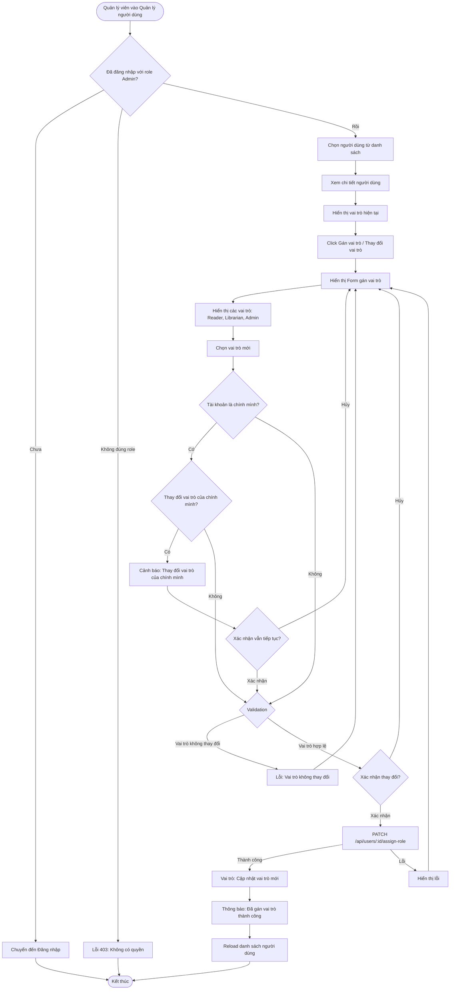

# 2.6.2 - Gán Vai Trò (Assign Role)

## Tổng Quan
Luồng cho phép quản lý viên gán hoặc thay đổi vai trò của người dùng.

## Actor
- Quản lý viên (Admin) - cần đăng nhập

## Mermaid Flowchart



## Các Bước Chi Tiết

### 1. Chọn người dùng
- Quản lý viên vào "Quản lý người dùng"
- Click vào người dùng muốn gán vai trò
- Hoặc click "Gán vai trò" trên bảng

### 2. Xem vai trò hiện tại
- Hiển thị vai trò hiện tại của người dùng
- Các vai trò có sẵn:
  - **Reader:** Chỉ có thể mượn sách, xem lịch sử cá nhân
  - **Librarian:** Có thể quản lý sách, xác nhận mượn/trả, theo dõi phạt
  - **Admin:** Toàn quyền, quản lý tài khoản, báo cáo, cài đặt

### 3. Chọn vai trò mới
- Dropdown chọn vai trò: Reader / Librarian / Admin
- Hiển thị mô tả vai trò

### 4. Xác nhận
- Kiểm tra: Vai trò có thay đổi không
- Nếu thay đổi vai trò của chính mình: Cảnh báo
- Xác nhận trong modal

### 5. Cập nhật vai trò
- API: `PATCH /api/users/:id/assign-role`
- Body:
  ```json
  {
    "role": "Librarian"
  }
  ```
- Cập nhật vai trò trong database

### 6. Thông báo kết quả
- Thành công: "Đã gán vai trò thành công"
- Lỗi: Hiển thị lỗi cụ thể

## Validation Rules

| Field | Rules |
|-------|-------|
| Vai trò | - Phải chọn từ: Reader, Librarian, Admin<br>- Phải khác với vai trò hiện tại |

## API Endpoints

| Method | Endpoint | Description |
|--------|----------|-------------|
| GET | `/api/users/:id` | Lấy chi tiết người dùng |
| PATCH | `/api/users/:id/assign-role` | Gán vai trò |

## Request Body

```json
{
  "role": "Librarian"
}
```

## Response

### Success (200)
```json
{
  "message": "Đã gán vai trò thành công",
  "data": {
    "id": 1,
    "email": "user@example.com",
    "name": "Nguyễn Văn A",
    "role": "Librarian",
    "previousRole": "Reader"
  }
}
```

## Error Handling

| Lỗi | Thông báo | Status Code |
|-----|-----------|-------------|
| Chưa đăng nhập | "Vui lòng đăng nhập" | 401 |
| Không có quyền Admin | "Bạn không có quyền truy cập" | 403 |
| Người dùng không tồn tại | "Không tìm thấy người dùng" | 404 |
| Vai trò không hợp lệ | "Vai trò không hợp lệ" | 400 |
| Vai trò không thay đổi | "Vai trò không thay đổi" | 400 |
| Gán vai trò cho chính mình | "Cảnh báo: Bạn đang thay đổi vai trò của chính mình" | 400 |

