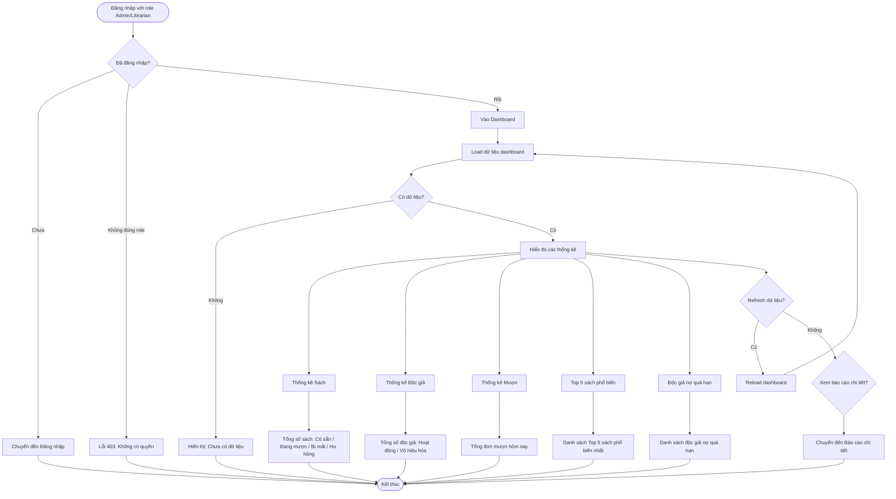

# 2.7.1 - Báo Cáo Tổng Quan (Dashboard Overview)

## Tổng Quan
Luồng cho phép quản lý viên và nhân viên thư viện xem dashboard tổng quan với các thống kê chính.

## Actor
- Quản lý viên (Admin)
- Nhân viên thư viện (Librarian)

## Mermaid Flowchart



## Các Bước Chi Tiết

### 1. Truy cập dashboard
- Đăng nhập với role Admin hoặc Librarian
- Vào dashboard (`/admin/dashboard` hoặc `/librarian/dashboard`)

### 2. Load dữ liệu dashboard
- API: `GET /api/dashboard`
- Load tất cả thống kê cùng lúc hoặc từng phần

### 3. Hiển thị thống kê

#### a. Thống kê Sách
- Tổng số sách: Có sẵn / Đang mượn / Bị mất / Hư hỏng
- Hiển thị dạng card hoặc biểu đồ

#### b. Thống kê Độc giả
- Tổng số độc giả: Hoạt động / Vô hiệu hóa
- Hiển thị dạng card

#### c. Thống kê Mượn
- Tổng đơn mượn hôm nay
- So sánh với ngày hôm qua (nếu có)

#### d. Top 5 sách phổ biến nhất
- Danh sách 5 sách có lượt mượn nhiều nhất
- Hiển thị: Tên sách, Số lượt mượn

#### e. Danh sách độc giả nợ quá hạn
- Danh sách độc giả có sách quá hạn chưa trả
- Hiển thị: Tên độc giả, Số sách quá hạn, Số ngày quá hạn

### 4. Refresh dữ liệu
- Nút "Refresh" để reload dữ liệu mới nhất
- Auto-refresh mỗi 5 phút (optional)

### 5. Xem báo cáo chi tiết
- Click vào từng phần thống kê
- Chuyển đến trang "Báo cáo chi tiết"

## API Endpoints

| Method | Endpoint | Description |
|--------|----------|-------------|
| GET | `/api/dashboard` | Lấy dữ liệu dashboard |

## Response

### Success (200)
```json
{
  "data": {
    "books": {
      "total": 1000,
      "available": 500,
      "borrowed": 400,
      "lost": 50,
      "damaged": 50
    },
    "readers": {
      "total": 200,
      "active": 180,
      "inactive": 20
    },
    "borrows": {
      "today": 15,
      "yesterday": 12
    },
    "topBooks": [
      {
        "id": 1,
        "title": "Harry Potter",
        "borrowCount": 50
      }
    ],
    "overdueReaders": [
      {
        "id": 1,
        "name": "Nguyễn Văn A",
        "overdueCount": 2,
        "daysOverdue": 5
      }
    ]
  }
}
```

## Error Handling

| Lỗi | Thông báo | Status Code |
|-----|-----------|-------------|
| Chưa đăng nhập | "Vui lòng đăng nhập" | 401 |
| Không có quyền xem dashboard | "Bạn không có quyền truy cập" | 403 |
| Mất kết nối | "Không thể tải dữ liệu dashboard" | - |
| API timeout | "Tải dữ liệu quá lâu, vui lòng thử lại" | - |

