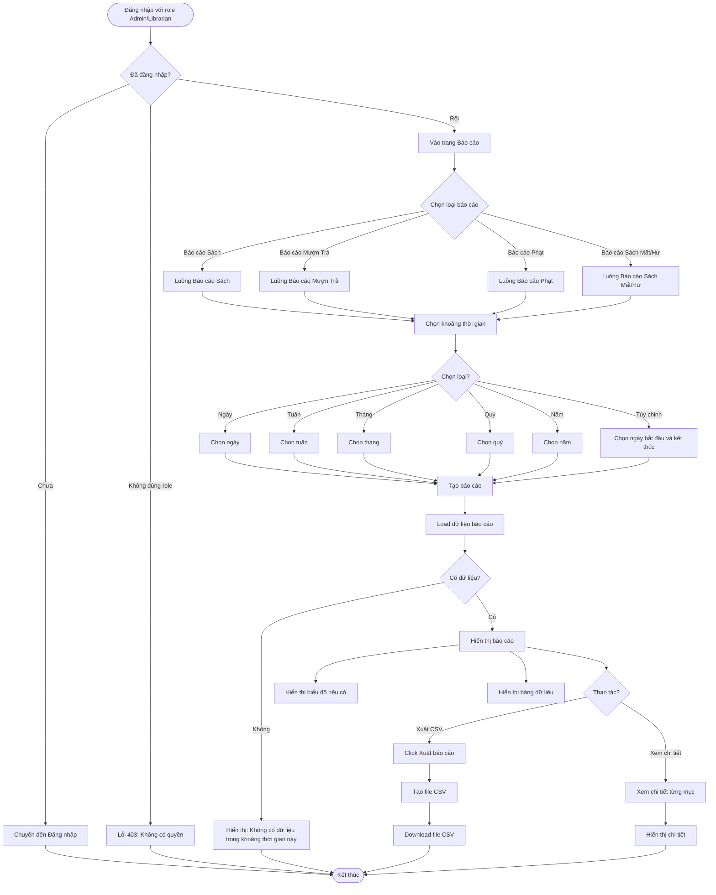

# 2.7.2 - Báo Cáo Chi Tiết (Detailed Reports)

## Tổng Quan
Luồng cho phép quản lý viên và nhân viên thư viện xem và xuất các báo cáo chi tiết.

## Actor
- Quản lý viên (Admin)
- Nhân viên thư viện (Librarian)

## Mermaid Flowchart



## Các Bước Chi Tiết

### 1. Truy cập trang báo cáo
- Đăng nhập với role Admin hoặc Librarian
- Vào trang "Báo cáo" (`/admin/reports` hoặc `/librarian/reports`)

### 2. Chọn loại báo cáo

#### a. Báo cáo Sách
- Tổng số sách
- Tình trạng sách (Có sẵn, Đang mượn, Bị mất, Hư hỏng)
- Số lần mượn theo sách

#### b. Báo cáo Mượn Trả
- Số lần mượn/trả theo ngày/tháng/quý
- Thống kê theo thời gian

#### c. Báo cáo Phạt
- Tổng doanh thu phạt
- Người nợ ngoài hạn
- Phân loại theo nguyên nhân phạt

#### d. Báo cáo Sách Mất/Hư
- Danh sách sách cần thay thế
- Thống kê sách mất/hư hỏng

### 3. Chọn khoảng thời gian
- **Ngày:** Chọn ngày cụ thể
- **Tuần:** Chọn tuần
- **Tháng:** Chọn tháng
- **Quý:** Chọn quý
- **Năm:** Chọn năm
- **Tùy chỉnh:** Chọn ngày bắt đầu và kết thúc

### 4. Tạo báo cáo
- Click "Tạo báo cáo"
- API: `GET /api/reports/:type?startDate=...&endDate=...`
- Load dữ liệu theo khoảng thời gian

### 5. Hiển thị báo cáo
- **Biểu đồ:** Hiển thị dạng chart (nếu có)
- **Bảng dữ liệu:** Hiển thị chi tiết dạng bảng

### 6. Xuất báo cáo
- Click "Xuất báo cáo"
- Tạo file CSV
- Download file

## API Endpoints

| Method | Endpoint | Description |
|--------|----------|-------------|
| GET | `/api/reports/books` | Báo cáo sách |
| GET | `/api/reports/borrows` | Báo cáo mượn trả |
| GET | `/api/reports/fines` | Báo cáo phạt |
| GET | `/api/reports/lost-damaged` | Báo cáo sách mất/hư |
| GET | `/api/reports/export/:type` | Xuất báo cáo CSV |

## Query Parameters

| Param | Type | Description |
|-------|------|-------------|
| `startDate` | string | Ngày bắt đầu (YYYY-MM-DD) |
| `endDate` | string | Ngày kết thúc (YYYY-MM-DD) |
| `period` | string | Khoảng thời gian: `day`, `week`, `month`, `quarter`, `year` |

## Response

### Success (200)
```json
{
  "data": {
    "period": "2024-01",
    "books": {
      "total": 1000,
      "byStatus": {
        "available": 500,
        "borrowed": 400,
        "lost": 50,
        "damaged": 50
      },
      "topBorrowed": [...]
    }
  }
}
```

## Error Handling

| Lỗi | Thông báo | Status Code |
|-----|-----------|-------------|
| Chưa đăng nhập | "Vui lòng đăng nhập" | 401 |
| Không có quyền xem báo cáo | "Bạn không có quyền truy cập" | 403 |
| Khoảng thời gian không hợp lệ | "Khoảng thời gian không hợp lệ" | 400 |
| Không có dữ liệu | "Không có dữ liệu trong khoảng thời gian này" | 404 |
| Lỗi khi xuất CSV | "Không thể xuất báo cáo" | 500 |

