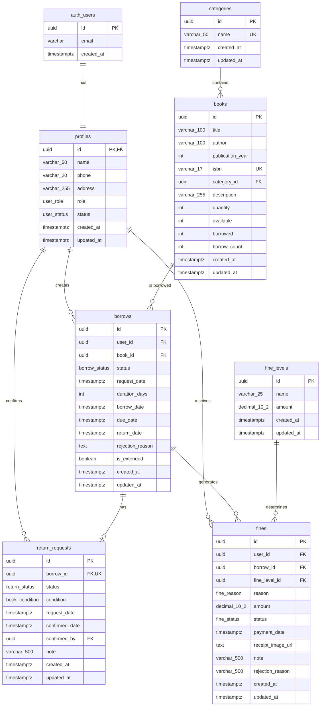

# Database Schema - Hệ Thống Quản Lý Thư Viện

## Entity-Relationship Diagram (ERD)



## Bảng Chi Tiết

### 1. profiles
Bảng mở rộng từ `auth.users` của Supabase để lưu thông tin bổ sung của người dùng.

| Column | Type | Constraints | Description |
|--------|------|-------------|-------------|
| id | uuid | PK, FK → auth.users.id | ID người dùng |
| name | varchar(50) | NOT NULL | Tên người dùng |
| phone | varchar(20) | | Số điện thoại |
| address | varchar(255) | | Địa chỉ |
| role | user_role | NOT NULL, DEFAULT 'reader' | Vai trò: reader, librarian, admin |
| status | user_status | NOT NULL, DEFAULT 'pending' | Trạng thái: pending, active, inactive |
| created_at | timestamptz | NOT NULL, DEFAULT now() | Ngày tạo |
| updated_at | timestamptz | NOT NULL, DEFAULT now() | Ngày cập nhật |

### 2. categories
Danh mục thể loại sách.

| Column | Type | Constraints | Description |
|--------|------|-------------|-------------|
| id | uuid | PK, DEFAULT gen_random_uuid() | ID thể loại |
| name | varchar(50) | NOT NULL, UNIQUE | Tên thể loại |
| created_at | timestamptz | NOT NULL, DEFAULT now() | Ngày tạo |
| updated_at | timestamptz | NOT NULL, DEFAULT now() | Ngày cập nhật |

### 3. books
Thông tin sách trong thư viện.

| Column | Type | Constraints | Description |
|--------|------|-------------|-------------|
| id | uuid | PK, DEFAULT gen_random_uuid() | ID sách |
| title | varchar(100) | NOT NULL | Tên sách |
| author | varchar(100) | NOT NULL | Tác giả |
| publication_year | int | CHECK (1900 ≤ year ≤ current_year) | Năm xuất bản |
| isbn | varchar(17) | UNIQUE | ISBN-10 hoặc ISBN-13 |
| category_id | uuid | FK → categories.id | ID thể loại |
| description | varchar(255) | NOT NULL | Mô tả |
| quantity | int | NOT NULL, CHECK (≥ 0) | Tổng số lượng |
| available | int | NOT NULL, CHECK (≥ 0) | Số lượng có sẵn |
| borrowed | int | NOT NULL, DEFAULT 0, CHECK (≥ 0) | Số đang mượn |
| borrow_count | int | NOT NULL, DEFAULT 0, CHECK (≥ 0) | Tổng lượt mượn |
| created_at | timestamptz | NOT NULL, DEFAULT now() | Ngày tạo |
| updated_at | timestamptz | NOT NULL, DEFAULT now() | Ngày cập nhật |

### 4. borrows
Đơn mượn sách.

| Column | Type | Constraints | Description |
|--------|------|-------------|-------------|
| id | uuid | PK, DEFAULT gen_random_uuid() | ID đơn mượn |
| user_id | uuid | FK → profiles.id, NOT NULL | ID độc giả |
| book_id | uuid | FK → books.id, NOT NULL | ID sách |
| status | borrow_status | NOT NULL, DEFAULT 'pending' | Trạng thái: pending, borrowed, returned, rejected |
| request_date | timestamptz | NOT NULL, DEFAULT now() | Ngày yêu cầu |
| duration_days | int | NOT NULL, CHECK (14 ≤ days ≤ 30) | Số ngày mượn |
| borrow_date | timestamptz | | Ngày mượn (khi được xác nhận) |
| due_date | timestamptz | | Ngày hết hạn |
| return_date | timestamptz | | Ngày trả |
| rejection_reason | text | | Lý do từ chối |
| is_extended | boolean | NOT NULL, DEFAULT false | Đã gia hạn chưa |
| created_at | timestamptz | NOT NULL, DEFAULT now() | Ngày tạo |
| updated_at | timestamptz | NOT NULL, DEFAULT now() | Ngày cập nhật |

### 5. return_requests
Yêu cầu trả sách.

| Column | Type | Constraints | Description |
|--------|------|-------------|-------------|
| id | uuid | PK, DEFAULT gen_random_uuid() | ID yêu cầu trả |
| borrow_id | uuid | FK → borrows.id, NOT NULL, UNIQUE | ID đơn mượn |
| status | return_status | NOT NULL, DEFAULT 'pending' | Trạng thái: pending, confirmed |
| condition | book_condition | | Tình trạng sách: normal, damaged, lost |
| request_date | timestamptz | NOT NULL, DEFAULT now() | Ngày yêu cầu |
| confirmed_date | timestamptz | | Ngày xác nhận |
| confirmed_by | uuid | FK → profiles.id | ID nhân viên xác nhận |
| note | varchar(500) | | Ghi chú |
| created_at | timestamptz | NOT NULL, DEFAULT now() | Ngày tạo |
| updated_at | timestamptz | NOT NULL, DEFAULT now() | Ngày cập nhật |

### 6. fine_levels
Mức phạt (do Admin cấu hình).

| Column | Type | Constraints | Description |
|--------|------|-------------|-------------|
| id | uuid | PK, DEFAULT gen_random_uuid() | ID mức phạt |
| name | varchar(25) | NOT NULL | Tên mức phạt |
| amount | decimal(10,2) | NOT NULL, CHECK (> 0) | Số tiền |
| created_at | timestamptz | NOT NULL, DEFAULT now() | Ngày tạo |
| updated_at | timestamptz | NOT NULL, DEFAULT now() | Ngày cập nhật |

### 7. fines
Phiếu phạt.

| Column | Type | Constraints | Description |
|--------|------|-------------|-------------|
| id | uuid | PK, DEFAULT gen_random_uuid() | ID phiếu phạt |
| user_id | uuid | FK → profiles.id, NOT NULL | ID độc giả |
| borrow_id | uuid | FK → borrows.id | ID đơn mượn liên quan |
| fine_level_id | uuid | FK → fine_levels.id | ID mức phạt |
| reason | fine_reason | NOT NULL | Lý do: late_return, damaged, lost |
| amount | decimal(10,2) | NOT NULL, CHECK (> 0) | Số tiền phạt |
| status | fine_status | NOT NULL, DEFAULT 'unpaid' | Trạng thái: unpaid, pending_confirmation, paid, rejected |
| payment_date | timestamptz | | Ngày thanh toán |
| receipt_image_url | text | | URL ảnh biên lai |
| note | varchar(500) | | Ghi chú |
| rejection_reason | varchar(500) | | Lý do từ chối |
| created_at | timestamptz | NOT NULL, DEFAULT now() | Ngày tạo |
| updated_at | timestamptz | NOT NULL, DEFAULT now() | Ngày cập nhật |

## Enum Types

```sql
-- Vai trò người dùng
CREATE TYPE user_role AS ENUM ('reader', 'librarian', 'admin');

-- Trạng thái người dùng
CREATE TYPE user_status AS ENUM ('pending', 'active', 'inactive');

-- Trạng thái đơn mượn
CREATE TYPE borrow_status AS ENUM ('pending', 'borrowed', 'returned', 'rejected');

-- Trạng thái yêu cầu trả
CREATE TYPE return_status AS ENUM ('pending', 'confirmed');

-- Tình trạng sách khi trả
CREATE TYPE book_condition AS ENUM ('normal', 'damaged', 'lost');

-- Lý do phạt
CREATE TYPE fine_reason AS ENUM ('late_return', 'damaged', 'lost');

-- Trạng thái phiếu phạt
CREATE TYPE fine_status AS ENUM ('unpaid', 'pending_confirmation', 'paid', 'rejected');
```

## Indexes

### Performance Indexes
- `idx_profiles_role` - Lọc người dùng theo vai trò
- `idx_profiles_status` - Lọc người dùng theo trạng thái
- `idx_books_category_id` - Lọc sách theo thể loại
- `idx_books_title_author` - Tìm kiếm sách theo tên/tác giả
- `idx_borrows_user_id` - Lấy đơn mượn theo người dùng
- `idx_borrows_book_id` - Lấy đơn mượn theo sách
- `idx_borrows_status` - Lọc đơn mượn theo trạng thái
- `idx_fines_user_id` - Lấy phiếu phạt theo người dùng
- `idx_fines_status` - Lọc phiếu phạt theo trạng thái

### Unique Indexes
- `categories.name` - Tên thể loại không trùng
- `books.isbn` - ISBN không trùng
- `return_requests.borrow_id` - Mỗi đơn mượn chỉ có 1 yêu cầu trả

## Row Level Security (RLS) Policies

Tất cả các bảng đều bật RLS với các policy phù hợp theo vai trò:
- **Reader**: Chỉ xem/sửa dữ liệu của mình
- **Librarian**: Quản lý sách, xác nhận mượn/trả
- **Admin**: Toàn quyền

